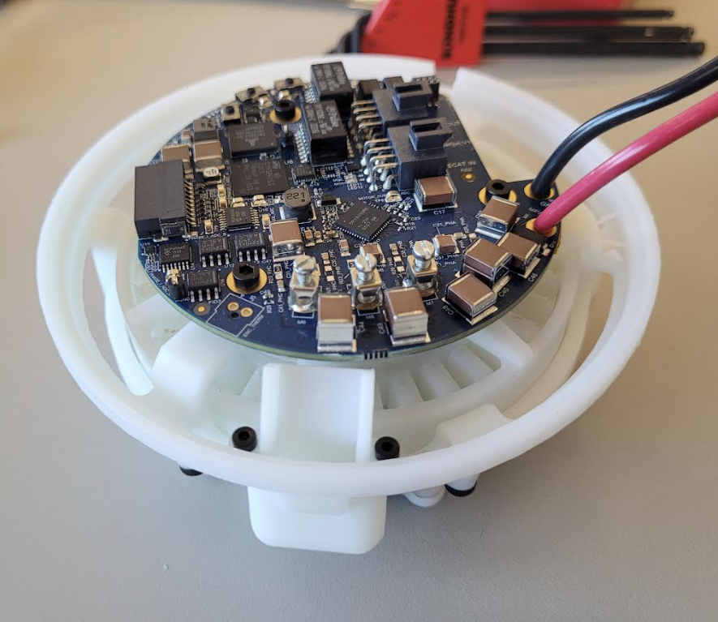

# Barkour Robot

The Barkour Robots are a series of agile quadruped robots developed by Google
DeepMind to support various research projects.

This repository contains the design assets (CAD, PCBA designs, assembly
instructions...) and core software (firmware and low level code) of the Barkour
robots.


## Contents

Detailed documentation is available in the `docs/` folder:

*   [Robot getting started/basic usage guide](docs/getting_started.md)
*   Software:
    *   [Embedded software (firmware)](docs/firmware.md)
    *   [Configuring EtherCAT](docs/ethercat_config.md)
    *   [Motor control example](docs/motor_control.md)
*   Hardware:
    *   [Hardware overview and specs](docs/hardware_overview.md)
    *   [Electronics (PCBA) design files](hardware/electronics)
    *   [Range of motion](docs/barkour_rom.md)
    *   [Cable assembly drawings (WireViz)](hardware/cable_drawings)
*   Robot assembly guides:
    *   [Barkour robot assembly](docs/full_barkour_robot_assembly.md)
    *   [Actuator assembly and setup](docs/actuator_assembly_and_setup.md)
    *   [Hip cover assembly](docs/hipcover_assembly_instructions.md)
    *   [Leg linkage assembly](docs/leglinkage_assembly_instructions.md)
    *   [Wireless E-stop (STO) assembly](docs/wsto_assembly.md)
    *   [IMU configuration](docs/imu_config.md)
    *   [Actuated head assembly](docs/actuated_head_assembly.md)

Mechanical CAD files and simulation environments are available at the following
links:

*   [CAD model](https://gdm.onshape.com/documents/2587dbf423d784b45437b14a/v/9e6d8c9f353498d7137f0ccc/e/bdcd5797385cee9e4f78dfef?aa=true)
*   Simulation:
    *   [MuJoCo model](https://github.com/google-deepmind/mujoco_menagerie/tree/main/google_barkour_vb)
    *   [MJX tutorial](https://github.com/google-deepmind/mujoco/blob/main/mjx/tutorial.ipynb)

### Mechanical design (CAD models)

We release 2 versions of the Barkour Robot. One version has a fixed head, the
other has an actuated head with a mouth (gripper). You can find the
[CAD models here](https://gdm.onshape.com/documents/2587dbf423d784b45437b14a/v/9e6d8c9f353498d7137f0ccc/e/bdcd5797385cee9e4f78dfef?aa=true)
for both versions.


### Hardware Usage

Please take a look at the [getting started guide](docs/getting_started.md).

### Simulation

The simulation models were previously released as part of the MuJoCo
[Menagerie](https://mujoco.readthedocs.io/en/stable/models.html). You can find
the MuJoCo model
[here](https://github.com/google-deepmind/mujoco_menagerie/tree/main/google_barkour_vb).

We support MJX for fast training on GPUs and TPUs. Please take a look at the
[MJX tutorial](https://github.com/google-deepmind/mujoco/blob/main/mjx/tutorial.ipynb)
to train a policy in minutes.


### Electronics designs (PCBA)

We are including the schematics and PCB layout files for the custom electronics
on the Barkour robots. Take a look in the `hardware/electronics` folder.

You can find drawings of all custom cable assemblies in the
`hardware/cable_drawings` folder.

The Barkour robots use a custom motor driver that communicates with an on-board
computer over EtherCAT:



### Assembly guides

We have a complete robot assembly guide to build robots from scratch. Take a
look at the following assembly guides:

-   [Barkour robot assembly](docs/full_barkour_robot_assembly.md)
-   [Actuator assembly and setup](docs/actuator_assembly_and_setup.md)
-   [Hip Cover Assembly instruction](docs/hipcover_assembly_instructions.md)
-   [Leg Linkage Assembly Instructions](docs/leglinkage_assembly_instructions.md)
-   [Wireless E-stop (STO) assembly](docs/wsto_assembly.md)

and here for the
[Bill of Materials (BOM)](hardware/barkour_robot_bill_of_materials.csv).

If you are curious about the actuated head, you can find the assembly
instructions [here](docs/actuated_head_assembly.md)


### Embedded software and host side software

The Barkour motor drivers use custom firmware based on the
[Pigweed](https://pigweed.dev) open-source project. You can find the firmware in
the `actuator/firmware` folder and our firmware guide [here](docs/firmware.md).
We also provide [a hostside example](docs/motor_control.md) to control the
actuators via EtherCAT and a guide to
[configure EtherCAT](docs/ethercat_config.md).

Note: We are cleaning up our firmware and will upload it to the repository soon.

## Hardware capabilities

The gifs below illustrate the hardware capabilities of the Barkour Robot
platform:


## Older versions

This release contains the "vB" version of the Barkour Robot. As part of our
earlier work, we used an older version of the hardware, called "v0". You can
find the assets for the v0 version at the following links:

-   [CAD](https://gdm.onshape.com/documents/8bcc0544056aa5de830b6353/w/9f4df6916bccef9b9b882a52/e/9296b0bcf28e5f27569d4cdb),
-   [simplified CAD for URDF export](https://deepmind.onshape.com/documents/bd3aaf26c384d7d058cee090/w/9bd0468bf4dae717e9b02f17/e/6151d1e161dfa46066201d62),
-   [sim](https://github.com/google-deepmind/mujoco_menagerie/tree/main/google_barkour_v0),
-   [Barkour obstacle course sim](https://github.com/google-deepmind/mujoco_menagerie/tree/main/google_barkour_v0),
-   [Barkour course scoring script](https://github.com/google/brax/blob/main/brax/experimental/barkour/score_barkour.py).

## Citing this work

If you like this work or make use of our designs, please cite:

```latex
@article{caluwaerts2023barkour,
  title={Barkour: Benchmarking animal-level agility with quadruped robots},
  author={Caluwaerts, Ken and Iscen, Atil and Kew, J Chase and Yu, Wenhao and Zhang, Tingnan and Freeman, Daniel and Lee, Kuang-Huei and Lee, Lisa and Saliceti, Stefano and Zhuang, Vincent and others},
  journal={arXiv preprint arXiv:2305.14654},
  year={2023}
}
```

## License and disclaimer

Copyright 2024 DeepMind Technologies Limited

All software is licensed under the Apache License, Version 2.0 (Apache 2.0); you
may not use this file except in compliance with the Apache 2.0 license. You may
obtain a copy of the Apache 2.0 license at:
https://www.apache.org/licenses/LICENSE-2.0

All other materials are licensed under the Attribution-NonCommercial 4.0
International (CC BY-NC). You may obtain a copy of the CC BY-NC license at:
https://creativecommons.org/licenses/by-nc/4.0/legalcode

Unless required by applicable law or agreed to in writing, all software and
materials distributed here under the Apache 2.0 or CC BY-NC licenses are
distributed on an "AS IS" BASIS, WITHOUT WARRANTIES OR CONDITIONS OF ANY KIND,
either express or implied. See the licenses for the specific language governing
permissions and limitations under those licenses.

This is not an official Google product.
