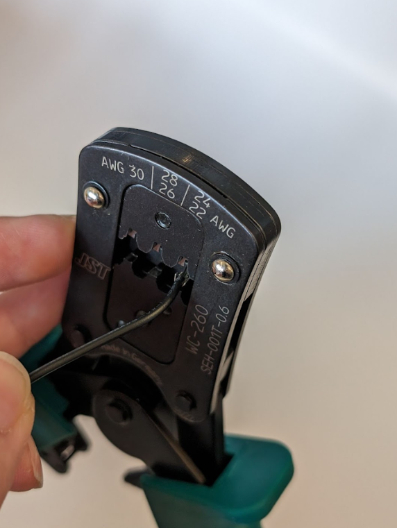
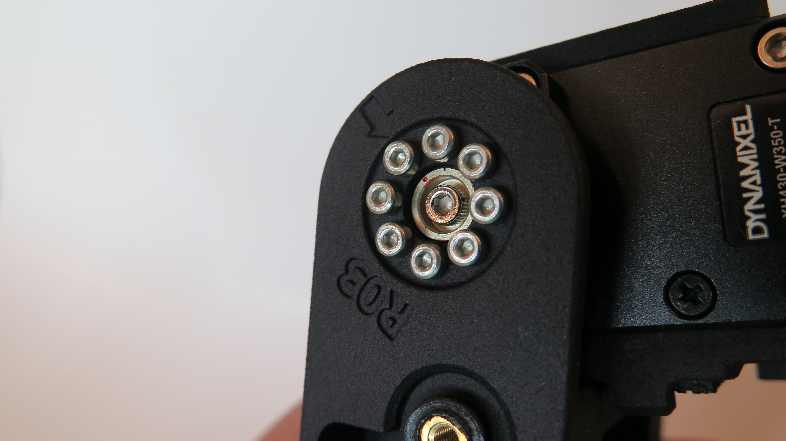
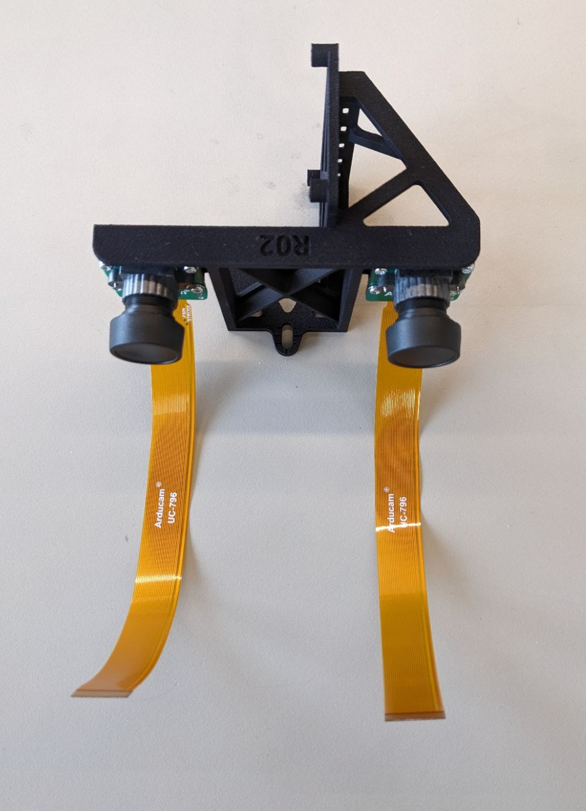
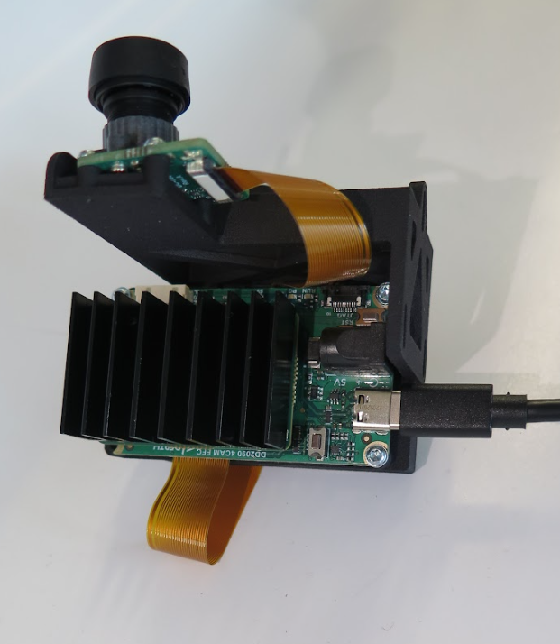
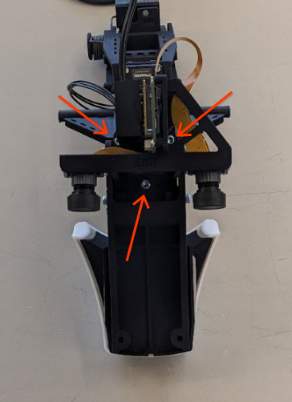
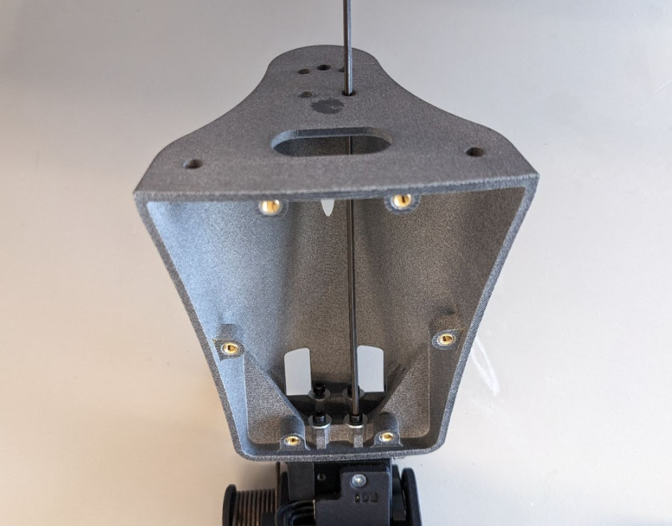
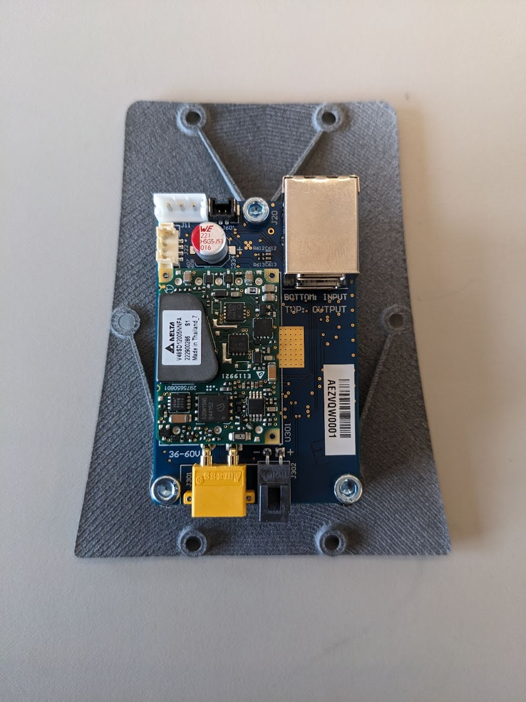

# Barkour Robot Actuated Head Assembly

This document describes the assembly instructions for the actuated head.

The actuated head adds 2 degrees of freedom to the robot's neck as well as a
mouth (gripper). In this hardware variant, the Intel RealSense camera is removed
and image/depth data is instead provided by RGB and ToF sensors located in the
robot's eye sockets.


### Neck Base Structure


#### Parts Required

Prepare the following parts:

Qty | Part No.  | Description
--- | --------- | --------------------------------------------
6   | 94510A030 | M3x0.5, 4.8mm long expanding threaded insert

Prepare the following tools:

Qty | Tool  | Where used | Torque?
--- | ----- | ---------- | -------
1   | Punch | Step 2     | N/A

#### Instructions

1.  Partially place expanding inserts into all six holes by hand, as shown:


1.  Using a flat-faced punch, firmly press the insert into the hole until the
    top edge is flush with the part face, as shown: {value=2}


### Neck Base Cover Structure


#### Parts Required

Prepare the following parts:

Qty | Part No.  | Description
--- | --------- | --------------------------------------------
3   | 94510A030 | M3x0.5, 4.8mm long expanding threaded insert

Prepare the following tools:

Qty | Tool  | Where used | Torque?
--- | ----- | ---------- | -------
1   | Punch | Step 2     | N/A

#### Instructions

1.  Partially place expanding inserts into both holes by hand, as shown:


1.  Using a flat-faced punch, firmly press the insert into the hole until the
    top edge is flush with the part face, as shown: {value=2}


### Neck Structure


#### Parts required

Prepare the following parts:

Qty | Part No.  | Description
--- | --------- | --------------------------------------------
5   | 94180A333 | M3x0.5,6.4mm long heat press threaded insert

Prepare the following tools:

Qty | Tool                                  | Where used | Torque?
--- | ------------------------------------- | ---------- | -------
1   | M3 Heat Insert press tip              | Step 1     | N/A
1   | Temperature controlled soldering iron | Step 2     | N/A

#### Instructions

WARNING: Soldering irons are hot. Be aware of both burn and fire hazards.

1.  Install the M3 heat insert press tip into a temperature controlled soldering
    iron.
2.  Set the iron's temperature to 140C.
3.  Gently press the heat press insert into the neck structure using the iron.
    Stop when the top surface is flush with the part. Flushed or slightly
    sub-flushed is good to avoid the flash (melted material) from interfering
    with subsequent assembly. Support the thinner flange from underneath to
    avoid excessive stress that might bend or break the part.


### Head Structure


#### Parts required

Prepare the following parts:

Qty | Part No.  | Description
--- | --------- | --------------------------------------------
9   | 94180A333 | M3x0.5,6.4mm long heat press threaded insert

Prepare the following tools:

Qty | Tool                                  | Where used | Torque?
--- | ------------------------------------- | ---------- | -------
1   | M3 Heat Insert press tip              | Step 1     | N/A
1   | Temperature controlled soldering iron | Step 2     | N/A

#### Instructions

WARNING: Soldering irons are hot. Be aware of both burn and fire hazards.

1.  Install the M3 heat insert press tip into a temperature controlled soldering
    iron.
2.  Set the iron's temperature to 140C.
3.  Gently press the heat press insert into the neck structure using the iron.
    Stop when the top surface is flush with the part.


#### Instructions

1.  Install the M3 heat insert press tip into a temperature controlled soldering
    iron.
2.  Set the iron's temperature to 140C.
3.  Gently press the heat press insert into the neck structure using the iron.
    Stop when the top surface is flush with the part.


### Shells


#### Parts Required

Prepare the following parts:

Qty | Part No.            | Description
--- | ------------------- | --------------------------------------------
5   | 94510A030           | M3x0.5, 4.8mm long expanding threaded insert
1   | N/A                 | Head Shell
1   | N/A                 | Left Neck Shell
1   | N/A                 | Right Neck Shell
1   | SZ1-6.00-RGB-F4PD-9 | SZ1-6.00-RGB-F4PD Light Pipe

Prepare the following tools:

Qty | Tool                  | Where used | Torque?
--- | --------------------- | ---------- | -------
1   | Punch                 | Step 1     | N/A
1   | xacto blade           | Step 2     | N/A
1   | Dark permanent marker | Step 4     | N/A

#### Instructions

1.  Using a flat-faced punch, firmly press the insert into the hole until the
    top edge is flush with the part face, as shown: {value=1}


1.  Color the nose with the marker. {value=2}


1.  Using RT125, affix the LED base into the head shell. Allow to cure for at
    least an hour before use. Stock lightpipe is 6". Cut with scissors to 3"
    prior to bending. {value=3}


## Subassemblies

### Dynamixel Prep

#### Requirements:

**1. Dynamixel Wizard**

Dynamixel Wizard is an optimized tool for managing Dynamixel motors from various
operating systems. In order to proceed with motor ID assignment, you will need
Dynamixel Wizard installed onto your machine. You can find the downloadable
software and installation instructions on the
[Dynamixel Wizard website](https://emanual.robotis.com/docs/en/software/dynamixel/dynamixel_wizard2/).

**2. U2D2 Connector Assembly**

The U2D2 connector assembly is a small size USB communication converter that
enables to control and to operate the DYNAMIXEL with the PC.


#### ID Assignment

1.  Run the Dynamixel Wizard

2.  In **Options > Scan**, ensure that all of the protocols, baudrates, and
    ports are enabled prior to scanning. Lower the **ID range** to make the
    scanning process faster.


1.  Ensure the U2D2 assembly has power and a data connection to your PC. Plug
    the U2D2's JST connector into the desired Dynamixel motor. Once the
    connection has been made, begin the **Scan**. Once the Wizard locates your
    desired Dynamixel motor, you may press **skip** to safely end the scan
    before completion. {value=3}


1.  **Connect** to the motor and locate **ID** in the item list. Change the
    motor's ID assignment to correspond with the motor's desired function:
    {value=4}

Function   | ID Assignment
---------- | -------------
Neck Pitch | ID 1
Head Yaw   | ID 2
Jaw        | ID 3


NOTE: During the motor ID assignment phase, the motors should be all be clocked
to the same orientation when looking at the absolute encoder count, such that
the programming is consistent from head unit to head unit.

NOTE: Be sure to **Save** any changes you make prior to disconnect.

1.  While you're here, now is a good opportunity to test the functionality of
    the Dynamixel motor. Enable **Torque** and mess with the dial a bit to
    ensure that the motor operates nominally. Alternatively, **Velocity** mode
    creates a smoother motion especially when testing the motors in the context
    of the head assembly. {value=5}


1.  When you are done, disable **Torque** and **Disconnect** from the motor
    *before* unplugging it from the U2D2 assembly. Congratulations! You are now
    ready for assembly. {value=6}

### Dynamixel Motor Cables Subassembly


#### Parts required

Prepare the following parts:

Qty | Part No.      | Description
--- | ------------- | --------------------------------------
6   | 2196761123    | Molex MINI SPOX 2.5 F-F 225MM 22 AWG B
4   | EHR-3         | JST CONN RCPT HSG 3POS 2.50MM
12  | SEH-001T-P0.6 | JST CONN SOCKET 22-30AWG CRIMP TIN

NOTE: 2x 225mm motor cables are being assembled for the neck pitch motor -> head
yaw motor, and the head yaw motor -> jaw motor

Prepare the following tools:

Qty | Tool                                   | Where used
--- | -------------------------------------- | ------------
1   | Wire cutter                            | Step 2, 4,
1   | Wire stripper                          | Step 3
1   | WC-260 TOOL HAND CRIMPER 22-30AWG SIDE | Step 5, 6, 7

#### Instructions

WARNING: Avoid cuts, ensure your cut direction with the blade is away from your
digits and body.

1.  Assemble the following items to make **2x of the 225mm** motor cable.
    {value=1}


1.  Cut the crimps off the wire and ensure the wire length is the length of the
    motor cable you're intending to make (either 100 or 225mm) {value=2}


NOTE: When stripping the wire for the next step, keep in mind that the second
set of "teeth", furthest away from the tip of the connector, should bite into
the insulation of the wire and the first set, closest to the tip of the
connector, should wrap around the stripped wire


1.  Strip ~1mm of the insulation jacket off. {value=3}


1.  Cut a crimp off from its bundle. {value=4}


1.  Pull back the crimp connector holder of the crimper and load the connector
    in. {value=5}


1.  Push the holder so it sits against the crimper again and ensure the
    connector is seated as shown. {value=6}


1.  Position the wire so that the furthest set of teeth from the tip of the
    connector bite into the insulation jacket and the closest set of teeth from
    the tip of the connector wrap around the stripped wire, and crimp the wire
    {value=7}



1.  Confirm that the wire crimped successfully and repeat Step 2 to 7 two more
    times so that there are 3 wires total {value=8}


1.  Line up the 3 crimped wires with 2 JST connector on each end {value=9}


1.  Insert each wire into a slot of the JST connector with the clip facing up
    and the JST connector oriented as shown below. The crimp should hook into
    place and can't be easily pulled out when seated correctly {value=10}


1.  For the second JST connector on the other end, ensure that each wire that is
    connected goes into the same slot number as it was inserted on the first JST
    connector. You may need to gently twist the wire so it goes in the correct
    orientation. {value=11}


1.  Ensure that the each wire of the cable is seated properly in the correct
    slot and doesn't slip out of the connector. Repeat step 2 - 11 for the other
    2 motor cables {value=12}


### Head Yaw and Jaw Motor Subassembly


#### Parts required

Prepare the following parts:

Qty | Part No.     | Description
--- | ------------ | ------------------------
1   | XH430-W350-T | Dynamixel
1   | N/A          | XH430-W350-T parts kit
1   | HN12-I101    | Dynamixel idler horn kit

Prepare the following tools:

Qty | Tool                   | Where used | Torque?
--- | ---------------------- | ---------- | -------
1   | M2.0 Hex Driver bit    | Step 10    | 0.6 Nm
1   | 10-80cNm Torque Driver | Step 10    | 0.6 Nm
1   | Torque Dat tool        | Step 10    | N/A

#### Instructions

1.  Grab the idler horn (HN12-I101) and a Dynamixel to build the jaw motor:
    {value=1}


1.  Remove the plastic cover from the Dynamixel: {value=2}


1.  Press the beige plastic top hat bushing from the idler horn kit into the
    Dynamixel: {value=3}


1.  Pop the silver idler horn into the top hat bushing and it'll click when it's
    fully seated: {value=4}


1.  Pop the black dust cover into the silver idler horn {value=5}


1.  Flip the dynamixel over, and use the included parts kit from the Dynamixel
    (XH430-W350-T) {value=6}


1.  Place the broad spacer washer into the dynamixel's drive-spline adjacent
    pocket: {value=7}


1.  Align the dot on the bearing output with the dot on the dynamixel output
    spline {value=8}


NOTE: Ensure it's properly aligned before applying any pressure. **No seriously,
go double check.**

1.  Gently press the bearing output down until the gap is closed between it and
    the dynamixel. If using an assembly press, do not force the assembly, apply
    smooth and firm pressure {value=9}


1.  Using the torque driver set to 0.6 Nm (60 cNm) with an M2 bit, install the
    1x M2.5x6 from the XH430-W350-T parts kit into the center of the output
    spline with the
    [Torque Dat tool](https://deepmind.onshape.com/documents/0ba344dda6e09547328e0696/v/92392d60ef98f2901f5156ce/e/58de78d6139db9c6235598f9).
    Set the motor aside for now. {value=10}


1.  Repeat step 1-10 to build the Head Yaw motor {value=11}

### Neck Pitch Motor Subassembly


#### Parts required

Prepare the following parts:

Qty | Part No.     | Description
--- | ------------ | ---------------------------------------------------------
1   | XH430-W350-T | Dynamixel
2   | N/A          | Spacers from XH430-W350-T parts kit
1   | EPX430-BR101 | Dynamixel enhanced output bearing
2   | N/A          | M2.5x17 SHCS with nylon patch from EPX430-BR101 parts kit
1   | N/A          | M2.5x8 SHCS with nylon patch from EPX430-BR101 parts kit
1   | HN12-I101    | Dynamixel idler horn kit
7   | 91263A421    | M2.5 X 5 SCREW FHCS
1   | 91458A116    | Threadlocker, Loctite 243
1   | N/A          | 3D Printed Neck Pitch Stop Upper
1   | N/A          | 3D Printed Neck Pitch Stop Lower
1   | 8613K11      | Neoprene foam sheet with adhesive backing

Prepare the following tools:

Qty | Tool                                  | Where used | Torque?
--- | ------------------------------------- | ---------- | -------
1   | xacto blade                           | Step 1     | N/A
1   | M1.5 Hex Driver bit                   | Step 13    | 0.6 Nm
1   | M2.0 Hex Driver bit                   | Step 7     | 0.6 Nm
1   | 10-80cNm Torque Driver                | Step 7     | 0.6 Nm
1   | Laser cut foam stencil for neck pitch | Step 1     | N/A

#### Instructions

WARNING: Avoid cuts, ensure your cut direction with a blade is away from your
digits and body.

1.  Prepare foam panel: Use scissors or laser cut stencils and a knife to cut
    out the
    [Foam Soft Stop Neck Pitch](https://deepmind.onshape.com/documents/0ba344dda6e09547328e0696/v/92392d60ef98f2901f5156ce/e/82d1fc98de6c8d07f2c26b93)
    panel. Set aside foam until the final step.


1.  Remove the two dynamixel bolts adjacent to the output spline: {value=2}


1.  Place 2x small spacers (from the XH430-W350-T parts kit) into the
    counterbored holes where the two bolts were removed from: {value=3}


1.  Place the broad spacer washer (from the EPX430-BR101 parts kit) into the
    dynamixel's drive-spline adjacent pocket: {value=4}


1.  Align the dot on the enhanced bearing output with the dot on the dynamixel
    output spline: {value=5}


NOTE: Ensure it's properly aligned before applying any pressure. **No seriously,
go double check.**

1.  Gently press the enhanced bearing output down until the gap is closed
    between it and the dynamixel. If using an assembly press, do not force the
    assembly, apply smooth and firm pressure. {value=6}
2.  Using the torque driver set to 0.6 Nm (60 cNm) with an M2 bit, install the
    1x M2.5x8 into the center of the output spline. Note that the motor
    backdriving torque sets the upper limit on screw installation torque and
    prevents damage to the motor.


1.  Using the torque driver set to 0.6 Nm with an M2 bit, install the 2x M2.5x17
    SHCS (from the EPX430-BR101 kit) and the 2x M2.5x5 SHCS. {value=8}


1.  Flip the dynamixel over, and remove the black plastic cover. {value=9}
2.  Press the plastic top hat bushing (from the HN12-I101 kit) into the
    dynamixel.
3.  Pop the silver idler horn (from the HN12-I101 kit) into the bushing. Note
    that it will click when fully seated.
4.  Pop the dust cover into place.


1.  First, dab a small drop of Loctite 243 onto the 3x M2.5x5 FHCS. Using the
    torque driver set to 0.6 Nm with an M1.5 bit, install the 3x M2.5x5mm FHCS
    into the 3D Printed Neck Pitch Stop Upper. {value=13}


1.  First, dab a small drop of Loctite 243 onto the 4x M2.5x5 FHCS. Using the
    torque driver set to 0.6 Nm with an M1.5 bit, install the 4x M2.5x5mm FHCS
    into the 3D Printed Neck Pitch Stop Lower. {value=14}


1.  As a final step, remove the adhesive backing from the neck pitch foam you
    cut out during step 1. Install it into the pocket on the printed structure
    installed to the side of the subassembly in step 14. {value=15}


### Neck Subassembly


NOTE: The above exploded views are missing the neck pitch motor. Refer to
detailed assembly pictures below.

#### Parts required

Prepare the following parts:

Qty | Part No.  | Description
--- | --------- | ------------------------------------
1   | N/A       | Neck Pitch Motor
1   | N/A       | Neck Pitch Motor Idler Shim
1   | N/A       | Neck Structure
8   | 90128A178 | M2x0.4 x 6mm SHCS
8   | 91263A411 | M2x0.4 x 4mm FHCS
1   | TO-5188L  | Torsion Spring
1   | N/A       | Spring Mandrel
1   | 91502A103 | M3x0.5 x 8mm SHCS
1   | N/A       | Dynamixel with idler horn installed
8   | 96817A317 | M2.5x 0.45 x 5mm SHCS
1   | 91458A116 | Threadlocker, Loctite 243
1   | N/A       | Dynamixel Motor Cable (Stock; 185mm)
2   | N/A       | Dynamixel Motor Cable (225mm)

Prepare the following tools:

Qty | Tool                   | Where used    | Torque?
--- | ---------------------- | ------------- | -------
1   | Tweezers               | Step 1        | N/A
1   | 10-80cNm Torque Driver | Step 5,6,9,10 | 30 cNm
1   | M1.5 Hex Driver bit    | Step 5,6      | 30 cNm
1   | Needle Nosed pliers    | Step 7        | N/A
1   | M2.5 Hex Driver bit    | Step 9        | 30 cNm
1   | M2.0 Hex Driver bit    | Step 10       | 30 cNm

#### Instructions

1.  Insert the neck pitch motor into the neck structure first, then insert the
    idler shim between the motor and the structure. {value=1}


1.  Confirm alignment of the shim holes with the fastener holes on the motor.
    {value=2}


1.  Turning the motor over to the output side, rotate the neck structure to
    align the arrow with the marked dot on the motor. {value=3}


1.  Turn the motor back to the idler horn side to bias the neck structure
    towards the idle side. Torque down the 8x M2x4mm FHCS to 30 cNm. Torque down
    in a star pattern. {value=4}


1.  Turn the structure over one more time and torque down the 8x M2x6mm SHCS to
    30cNm. Set aside for now. {value=5}



1.  With pliers, bend the torsion spring to the correct configuration. This is
    estimated by the
    [drawing of TO-5188L](https://deepmind.onshape.com/documents/0ba344dda6e09547328e0696/v/92392d60ef98f2901f5156ce/e/19f8cd6aba48b1b9441f32f9)
    , however for a one-off build, the following ad hoc procedure may provide
    better results: (a) Place the spring into the mandrel. (b) Mark the location
    of the first bend with a permanent marker. (c) Make a bend using two pairs
    of pliers (regular + needle nose work well), accounting for the bend radius.
    (d) Put the spring back in the mandrel, check against the part, and repeat
    from (b) to make more bends. (e) Test the spring by running the neck through
    its full range of motion. Make any needed adjustments. {value=6}


1.  Install the torsion spring, using pliers to bend the spring into the
    position of the neck structure. {value=7}


1.  Install the spring mandrel on top of the spring and torque down the M3x8mm
    SHCS to 30cNm. {value=8}


1.  Insert the head yaw motor (dynamixel with idler horn installed) and torque
    down the 8x M2.5x5mm to 30cNm. These screws (and other motor mount
    locations) are critical and loosening due to vibration should be prevented
    using Loctite 425 (cyanoacrylate based) to avoid interaction between the
    loctite and plastic parts. {value=9}


1.  Install the stock 185mm Dynamixel motor cable on neck pitch motor. {value=10}

    NOTE: The original CAD indicates the spring is blocking the port. Depending
    on how the spring is bent, there may be a need to undo the spring to install
    the cable.


1.  Install one of the custom 225mm Dynamixel motor cable on other port of the
    neck pitch motor. Plug the cable to the motor before dropping the motor into
    the clevis of the neck structure. {value=11}


1.  With the same motor cable in step 11, wrap the cable around the mandrel of
    the neck structure and connect the other end of the cable to the head yaw
    motor. {value=12}

    NOTE: When wrapping the cable, the cabled should go over and under the
    mandrel. The numbers in the image indicate the order.


1.  Install the other custom 225mm Dynamixel motor cable on the other port of
    the head yaw motor. Then, test the full range of motion for the cable
    service loop before proceeding. {value=13}


### Head Subassembly


#### Parts required

Prepare the following parts:

Qty | Part No.  | Description
--- | --------- | -----------------------------------------
1   | N/A       | Head structure
1   | N/A       | Jaw Motor
6   | 91290A106 | SHCS M2.5x16
1   | 9714K18   | Wave, 0.787" ID, 1.094" OD, 0.012" Thick
1   | 90214A441 | Shim, 0.5mm Thick, 20mm ID
1   | N/A       | Space Washer, printed
8   | 90128A177 | SHCS M2x5
8   | 90128A179 | SHCS M2x8
8   | 98688A110 | Small OD flat washer, 2.2mm ID, 4.5mm OD
1   | N/A       | Upper Jaw Template
1   | 8613K11   | Neoprene foam sheet with adhesive backing
1   | N/A       | Jaw Upper Structure
4   | 91502A103 | SHCS M3x8
1   | 91458A116 | Threadlocker, Loctite 243
1   | TY23MX    | Zip tie 92mmx2.3mm

Prepare the following tools:

Qty | Tool                   | Where used       | Torque?
--- | ---------------------- | ---------------- | -------
1   | M2.0 Hex Driver Bit    | Step 2, 4, 5, 7  | 0.3 Nm
1   | Torque Dat tool        | Step 5, 7        | N/A
1   | M1.5 Hex Driver Bit    | Step 9, 10       | 0.3 Nm
1   | M2.5 Hex Driver bit    | Step 12          | N/A
1   | 10-80cNm Torque Driver | Step 4, 7, 9, 10 | 0.6 Nm
1   | Xacto blade            | Step 11          | N/A

#### Instructions

WARNING: Avoid cuts, ensure your cut direction with the blade is away from your
digits and body.

1.  Ensure head structure has 9x M3 heat inserts. If not, refer to the Head
    Structure section.

1.  Remove 3 out of 4 of the fasteners on each side of the Jaw motor that will
    be fasten to the head structure with a M2 Hex bit


1.  Pass the built 225mm motor cable that is connected to the head yaw motor
    through the window that's on the side through the right side (refer to image
    for direction) of the head structure. Connect the cable end to the jaw motor
    port. {value=3}


1.  Using the torque driver set to 0.3 Nm (30 cNm) with a M2 Hex bit, install
    the 3x SHCS M2.5x16 on **each** side of the dynamixel. The yellow shim
    pictured in the photo should not be needed for a well-toleranced print.
    These fasteners on motor mount locations are critical and loosening due to
    vibration should be prevented using Loctite 425. {value=4}


1.  With an M2 Hex bit, undo the fastener from the center of the output spline
    with the Torque Dat tool. Set the fastener aside for now. {value=5}


1.  Add wave(PN 9714k18) - shim(PN 90214A441) stack to the output side of the
    head yaw motor with the shim flushed on the motor and the wave on top
    between the shim and the head structure. Align the motor into the Head
    Structure {value=6}


NOTE: This next step may need one person to push the motor towards the output
side and another person insert the space washer on the idle side

1.  Insert the printed space washer to the idle side. Using the torque driver
    set to 0.6 Nm (60 cNm) with an M2 Hex bit, refasten the fastener to the
    center of the output spline with the Torque Dat tool {value=7}


1.  Align the motor output marker dot to the arrow on the head structure. Flip
    the head structure over to see the arrow {value=8}


1.  Fasten the head structure to the motor with 8x SHCS M2x5 on the output side
    with a M1.5 hex bit using the torque driver set to 0.3 Nm (30 cNm). Threaded
    holes on the motor are very shallow, <2mm depth. Take care to ensure that
    the screws do not bottom out on the motor body. {value=9}


1.  Fasten 8x SHCS M2x8 along with 8x small OD flat washer (PN 98688a110) for
    the idle side using the torque driver set to 0.3 Nm (30 cNm) {value=10}


1.  Using the upper jaw template, cut the foam and install onto the Jaw Upper
    Structure {value=11}


1.  Secure the part to the Head Structure using 4x SHCS M3x8 with a M2.5 bit
    {value=12}


1.  Loosely zip tie the motor cable to the outer anchor point on the head
    structure. {value=13}


### Camera Subassembly


NOTE: The above exploded view is showing 4 screws to mount the OAK module onto
the 3D printed camera bracket, however only 3 screws will fit.

#### Parts required.

Prepare the following parts:

Qty | Part No.           | Description
--- | ------------------ | -------------------------
2   | OAK-FFC-OV9782-M12 | Luxonis cameras
2   | LN056              | OAK lens
4   | 2000035198         | Lens lockrings
1   | A00470             | OAK-FFC-4P module
1   | N/A                | 3D printed camera bracket
1   | N/A                | USB-C to USB-C cable
8   | 96817A312          | TF M2x6
3   | 96817A317          | M2.5x6
3   | 91502A103          | SHCS M3x8
2   | N/A                | FFC Ribbon

Prepare the following tools:

Qty | Tool                   | Where used     | Torque?
--- | ---------------------- | -------------- | -------
1   | Spudger                | Step 1, 13, 16 | N/A
1   | T6 Driver bit          | Step 5         | 0.6 Nm
1   | T8 Driver bit          | Step 14        | N/A
1   | 10-80cNm Torque Driver | Step 15        | 0.3 Nm
1   | 1.85 mm drill bit      | Step 1         | N/A
1   | 2.3 mm drill bit       | Step 2         | N/A

#### Instructions

1.  If needed, carefully chase 8x holes for the camera mount with a 1.85 mm
    drill bit or reamer. Do not tap these holes, as they will subsequently take
    thread-forming screws.


1.  If needed, carefully chase 3x holes for the OAK Module with a 2.3 mm drill
    bit or reamer. Do not tap these holes, as they will subsequently take
    thread-forming screws. {value=2}


1.  Remove the FFC from the PCBA. {value=3}


1.  Align the camera PCBA over bracket holes. {value=4}
1.  Using the hand driver with an T6 bit, install the 4x TF M2x6(96817A312) in
    the following cross pattern. Install all 4 screws half way in before hand
    torquing it all down.


1.  Remove the lens by holding the camera fixture firmly and slowly twist the
    lens counterclockwise. {value=6}

WARNING: IT IS NOT POSSIBLE TO CLEAN SENSOR. PREVENT DIRT AND DUST FROM GOING IN
BY MINIMIZING THE AMOUNT OF TIME THE SENSOR IS UNCOVERED

1.  Grab a lockring and twist it onto the Low Distortion M12 lens. {value=7}


1.  Install the Low Distortion M12 lens by holding the camera fixture firmly and
    slowly twist the lens clockwise until the lens are half way in. {value=8}


WARNING: DO NOT TIGHTEN THE LENS ALL THE WAY, LEAVE IT HALFWAY TO ADJUST THE
FOCUSING IN A LATER STEP

1.  Re-attach the FFC that was disconnected from the first step. {value=9}
1.  Repeat the same process on the other side. {value=10}



1.  Using a hand driver with T8 bit, install 1x M2.5x6(96817A317) onto the
    bottom right of the camera bracket halfway in. {value=11}


1.  Route the right camera’s FFC ribbon in the camera bracket as shown.
    {value=12}


1.  Remove the OAK-FFC-4P from its packaging and locate the CAMB-2L in the back.
    Handle with care to prevent damage to the board with any built-up
    electrostatic charge. A wrist strap for grounding is a good idea. {value=13}


1.  Attach the right camera’s FFC into the CAMB-2L, oriented so that the wider
    trace on the FFC is to the side of the connector labeled "26". {value=14}


1.  Using a hand driver with T8 bit, install 2x M2.5x6(96817A317) on the top
    right and bottom left to loosely secure the OAK-FFC-4P onto the camera
    bracket. {value=15}
1.  Using a torque driver set to 0.3Nm (30 cNm) with an T8 bit, torque all 3x
    M2.5x6(96817A317). {value=16}


1.  Route the left camera’s FFC ribbon cable into the CAMA-4L, which is parallel
    CAMB-2L. You may have to make a couple sharp bends on the cable--but try to
    avoid unnecessary extra sharp bends. {value=17}


1.  Pre-plug the USB-C cable. {value=18}



1.  Using a torque driver set to 0.3Nm (30 cNm) with an M2.5 hex bit, install
    SHCS M3x8(91502A103) to mount the camera subassembly to the head structure.
    As the positional stability of the cameras is critical, use Loctite 425 on
    these fasteners. {value=19}



NOTE: Physical camera subassembly completed. Continue to Camera Focusing section
to have a functional camera subassembly.

### Lower Jaw Subassembly


NOTE: Exploded view does not include Jaw motor. Refer to detailed assembly
pictures below.

#### Parts required

Prepare the following parts:

Qty | Part No.  | Description
--- | --------- | -----------------------------------------
1   | N/A       | Lower Jaw Structure
1   | 8613K11   | Neoprene foam sheet with adhesive backing
1   | N/A       | Lower Jaw shell
1   | 91502A103 | M3x0.5 x 8mm SHCS
12  | 90128A178 | M2x0.4 x 6mm SHCS

Prepare the following tools:

Qty | Tool                                 | Where used | Torque?
--- | ------------------------------------ | ---------- | -------
1   | xacto blade or scissors              | Step 1     | N/A
1   | Laser cut foam stencil for lower jaw | Step 1     | N/A
1   | M2.5 Hex Driver bit                  | Step 3     | 30 cNm
1   | M1.5 Hex Driver bit                  | Step 6     | 30 cNm
1   | 10-80cNm Torque Driver               | Step 3,6   | 30 cNm

#### Instructions

WARNING: Avoid cuts, ensure your cut direction with the blade is away from your
digits and body.

1.  Prepare foam panel: Use scissors or laser cut stencils and a knife to cut
    out the
    [Foam Soft Stop lower jaw](https://deepmind.onshape.com/documents/0ba344dda6e09547328e0696/v/92392d60ef98f2901f5156ce/e/b567c901a6f57977d77b8571)
    panel. {value=1}


1.  Remove the adhesive backing and firmly apply the foam to the inner curvature
    of the lower jaw structure. {value=2}


1.  Flip the structure over to the bottom and align the lower jaw shell with the
    structure. Torque down the fasteners using M3x8mm to 30 cNm. {value=3}


1.  Attach the lower jaw to the jaw motor. The alignment is determined by an
    arrow that points away from the dot on the output side of the jaw motor.
    {value=4}


1.  Torque down both sides of the jaw structure with 12x M2x6mm to 30 cNm.
    {value=5}


### Final Integration

#### Parts required

Prepare the following parts:

Qty | Part No.     | Description
--- | ------------ | ---------------------------
4   | 340-M2512-61 | M2.5X12
3   | 91502A103    | M3x0.5 x 8mm SHCS
6   | 91263A823    | M3x0.5 x 8mm FHCS
3   | 90128A216    | M4x0.7 x 20mm SHCS
4   | 91100A110    | washer 2.7ID
1   | N/A          | 3D printed neck shell
1   | N/A          | 3D printed neck shell cover
1   | N/A          | Jackson PCBA
1   | N/A          | Fei-Fei power cable.

Prepare the following tools:

Qty | Tool                   | Where used  | Torque?
--- | ---------------------- | ----------- | -----------------
1   | 10-80cNm Torque Driver | Step 10, 17 | 0.3 Nm and 0.4 Nm
1   | Small torque wrench    | Step 4      | 0.5 Nm
1   | 2mm HEX T-handle       | Step 3      | N/A
1   | 3mm HEX T-handle       | Step 5      | N/A
1   | 3mm Low profile L-key  | Step 6      | N/A
1   | M2.5 Hex bit           | Step 10     | 0.4 Nm
1   | M2 Hex bit             | Step 17     | 0.3 Nm

#### Instructions

1.  Remove the Deep Fry Basket (DFB) from the Barkour Robot. {value=1}
1.  Pre-install the 4x m2.5X12(340-M2512-61) with washer 2.7ID(91100A110) into
    the holes of the 3D printed neck shell. {value=2}


1.  Using a 2mm HEX T-handle, install 4x M2.5X12(340-M2512-61) to mount the 3D
    printed neck shell onto the neck pitch motor. {value=3}



1.  Using a small torque wrench set to 0.5Nm(50 cNm) with 2mm HEX BIT, torque
    the screws down in the following cross pattern. {value=4}


1.  Using a 3mm HEX T-handle, install 1x M4x0.7(90128A216) to mount the other
    end of the 3D printed neck shell onto the torso. {value=5}


1.  Using a low profile 3mm l-key to install the other 2x M4x0.7(90128A216)
    until its hand tight. {value=6}
1.  Route the USB-C from the OAK module into the left hole of the neck shell.
    {value=7}


1.  Route the motor cable to the right hole of the neck shell. {value=8}


1.  Plug the power cable into the Fei-Fei board located inside the torso and
    route the other end into the neck base. {value=9}


1.  Using the torque driver set to 0.4 Nm (40 cNm) with an M2.5 hex bit, install
    3x M3x0.5 x 8mm SHCS(91502A103) to mount the Jackson PCBA onto the neck
    shell cover. {value=10}



1.  Plug in the motor cable into the Jackson board. {value=11}


1.  Plug in the USB-C from the OAK module into the Jackson board. {value=12}


1.  Plug in the power cable into the Jackson board. {value=13}


1.  Route the USB-C from the NUC through DFB like shown and through the neck
    base. {value=14}


1.  Plug in the USB-C from the NUC into the Jackson board. {value=15}


1.  Install the DFB back into the robot. {value=16}

WARNING: Be careful not to crush any cables. Double check the power cable that's
plugged into FEI FEI and the USB-C from NUC to ensure that there isn’t too much
tension.

1.  Using the torque driver set to 0.3 Nm (30 cNm) with an M2 bit, install 6x
    M3x0.5 x 8mm FHCS(91263A823) to mount the neck base cover. {value=17}


### Cosmetic Shell Subassembly


#### Parts required

Prepare the following parts:

Qty | Part No.  | Description
--- | --------- | -----------------
11  | 91502A103 | M3x0.5 x 8mm SHCS

Prepare the following tools:

Qty | Tool                | Where used | Torque?
--- | ------------------- | ---------- | -------
1   | M2.5 Hex Driver bit | Step 3     | 30 cNm

#### Instructions

1.  The head shell must be applied first. Tilting the head forward to get the
    lens holes to align first makes this step a little easier. Carefully guide
    the head shell on top of the head structure. Make sure to monitor the lens
    during application to avoid scratching the lens. The head shell should rest
    on the head structure ends. {value=1}


1.  Torque down 2x M3x8mm on each side of the head, below the ear, to 30 cNm.
    {value=2}


1.  In the upper jaw, torque down 2x M3x8mm to 30 cNm. {value=3}


1.  With the left neck shell, torque down 2x M3x8mm on the neck structure to 30
    cNm. {value=4}


1.  With the right neck shell, torque down the remaining 5x M2x8mm on the neck
    structure and opposite shell to 30 cNm. {value=5}


1.  Complete a final assembly check. Check range of motion for each joint
    individually, then compounded motions. Address any areas where cables add
    significant load to the motors. Check for counter-balance spring behavior.
    Then power the motors and run each motor to ensure the software-configured
    limits (motor parameters and virtual hard-stop) are correct.

## Camera Focusing

### Prerequisites

*   git
*   a USB port
*   basic command line knowledge

### Setup and focusing

1.  Install the Luxonis' depthai-python repo according to the
    [Luxonis instructions](https://docs.luxonis.com/projects/api/en/latest/install/).
2.  Plug the USB cable from the actuated head assembly into your computer.
3.  Run the script at `depthai-python/examples/ColorCamera/rgb_video.py` to open
    a viewer window and see the output from the camera. If your camera has been
    connected to the `CAM_B` port, you may need to open the script in a text
    editor of your choice and replace references to `CAM_A` with `CAM_B`.

```
cd depthai-python/examples/ColorCamera
python3 rgb_video.py
```

1.  Aim the head where it can see far from your desk. {value=4}
2.  Slowly adjust the lens until objects very far away are in focus.
3.  Aim the head to where it can see objects ~20-30cm away.
4.  Slowly tune the lens focus until those objects are reasonably well focused.
5.  Hold the lens in place, and gently tighten the lockring until tight.
6.  Verify focus by aiming the head further away. Repeat prior steps if needed.
