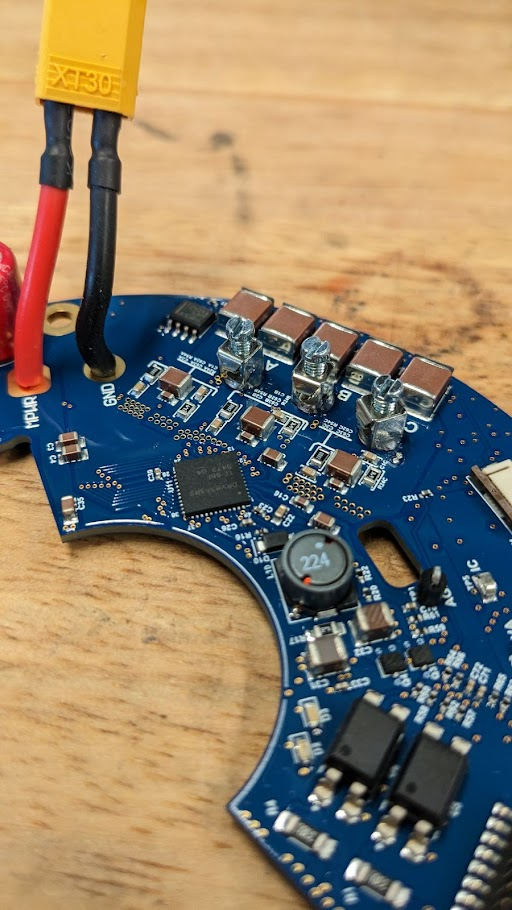
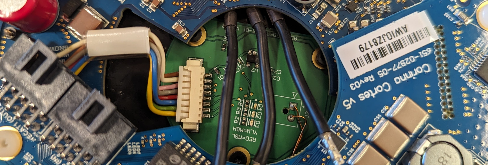

# Single Actuator Assembly and Software Configuration

[TOC]

## Overview

The following document details how to build a single motor sub-assembly and
configure it.

Three "monomotors" form a trimotor, and four trimotors complete a single robot.

Note: This document describes the single actuator assembly using the
Ada/Gebru/Cortes motor driver PCBAs. The Holberton PCBA incorporates all
features of the Ada, Gebru & Cortes boards into a single PCBA and can be used as
a drop-in replacement.

## Parts Needed

| Part Name                   | Quantity    | Description & Details           |
| --------------------------- | :---------: | ------------------------------- |
| ADA PBCA                    | 1           | Motor encoder and monitors      |
:                             :             : temperature.                    :
| Thermistor                  | 1           | Attached to the ADA.            |
| ADA Separator               | 1           |                                 |
| Ak80-9 motor                | 1           |                                 |
| M2x8mm SHCS, BO             | 3           | Fastens ADA & intermediary ADA  |
:                             :             : separator piece into the motor. :
| Heatsink                    | 1           | Machined part                   |
| M3x5mm SHCS, BO             | 8           | Fastens motor to heatsink.      |
| Thermal Pads                | *as needed* | *Advised to pre-cut prior to    |
:                             :             : assembly*                       :
| Gebru PCBA                  | 1           |                                 |
| Cortes PCBA                 | 1           |                                 |
| Board motor screw terminals | 3           | Connects motor phase-leads to   |
:                             :             : the PCBA cluster.               :
| Male XT30 pigtail           | 1           | Power connector on the Gebru.   |
| Encoder (ADA) harness       | 1           | Connects Gebru and ADA.         |
| M3x12mm Philips (nylon)     | 3           | Keeps the boards and motor      |
:                             :             : together.                       :
| M3x6mm SHCS (nylon)         | 1           | Same as above.                  |

## Assembly Procedure

1.  Prepare the ADA board.

    A. Solder the thermistor onto the PCBA at the two leads.

    

    B. Laser cut an Ada separator

    

2.  Install the ADA on the AK80-9 motor as shown below.

    A. Starting with a fresh motor, remove the stock cover to expose leads.

    

    

    B. Place the separator piece on the exposed motor...

    

    C. ...and fasten the board in-place to hand-tightness with the x3 M2x8mm
    bolts.

    

3.  Install the heatsink onto the motor assembly.

    A. Stage the heatsink on the motor as shown below.

    NOTE: Make sure the phase leads are routed under the bridge on the heatsink
    and **not crossed over each other**. *Also recommended to bend the
    thermistor as shown so it’s pointing upward and doesn't get pinched.*

    

    B. Apply Loctite 243 (*blue*) and install screws. Torque down in a star
    pattern to 2Nm.

    C. Glue the thermistor down into the notch on the heatsink.

    

    D. Cut out a ~10x35mm patch of thermal pad and stick it onto the bridge.

    

4.  Pair a Gebru PCBA with a Cortes PCBA to assemble our motor control cluster.

    A. Get a fresh Gebru board, three(3) board motor screw terminals, one (1)
    male XT30 pigtail, and one (1) encoder (Ada) harness.

    

    B. Strip the encoder cable wires (28ga AWG) and xt30 pigtail (16ga AWG) to
    ~50-60mm, then solder them to the Gebru along with the 3 screw-in terminals
    for the phase leads.

    

    

    

    

    C. Get a prepped Gebru, one (1) fresh Cortes, three (3) 4mm nylon spacers,
    three (3) M3x10mm nylon screws, and one(1) M3x6mm nylon screw.

    

    E. **CAREFULLY** marry the Gebru and Cortes together with the pin headers.
    **It is very easy to break or bend these header pins.**

    

    F. Make sure the x3 nylon spacers are in the corresponding positions. These
    line up to form the mounting points for the boards and the motor assembly.

    

5.  Installing the PCBA cluster onto the motor sub-assembly.

    A. Place the married Gebru and Cortes onto a prepped motor as shown below.
    Make sure to route the phase leads through the center hole of the board
    (**do not** cross the phase leads).

    

    B. Secure through the Cortes & Gebru into the motor with x3 M3x12mm nylon
    Philips head screws. In the *remaining hole only on the Gebru*, next to the
    red caps, use the shorter x1 M3x6mm nylon bolt to secure.

    C. Plug in the encoder cable into the ADA.

    

    D. Lastly, attach the phase leads to the screw-in terminals on the Gebru
    board(***Remember to not cross the phase leads and take caution not to short
    against the capacitors!***).

    

NOTE: You now have a complete motor assembly that's ready for flashing.

## Flashing and Calibration Instructions

After assembling the motor, we have to ensure that all the electronic components
are stable, the proper firmware is installed on our boards, and the motor moves
as expected.

### Required Equipment

| Part Name                      | Quantity | Description & Details            |
| ------------------------------ | :------: | -------------------------------- |
| Mataric board                  | 1        | Provides debug buttons and LEDS  |
:                                :          : for motor driver.                :
| J-Link Pro                     | 1        | Programmer, includes FC-20P      |
:                                :          : cable.                           :
| USB A-B cable                  | 1        | Connects J-Link to computer for  |
:                                :          : programming.                     :
| USB A to micro USB             | 1        | Connects Mataric to computer for |
:                                :          : debug logs.                      :
| Samtec 20 pos cable            | 1        | Connects Mataric and Cortes.     |
| USB → Ethernet dongle (TP-Link | 1        | Connects computer to EtherCAT on |
: UE306)                         :          : Cortes.                          :
| Ethernet -> EtherCAT connector | 1        | Connects dongle to Cortes.       |
| PSU -> STO/EtherCAT connector  | 1        | Enables STO (ECAT1) on Cortes.   |
| XT30 female -> PSU             | 1        | Powers the motor.                |
| USB extension cable (optional) | 1        | Dongle is short. Maybe need      |
:                                :          : extension to reach the computer. :
| Power Supply Unit (PSU, 2      | 1        | Powers motor setup and enables   |
: channels)                      :          : STO.                             :

### Hardware Setup

1.  Assemble the programming components.

    A. Connect the J-Link to the computer with the USB A-B cable.

    B. Connect the J-Link to the Mataric with the FC-20P cable that comes with
    the J-Link.

    C. Connect the Mataric and Cortes with the Samtec 20 pos cable.

    D. Connect the Mataric to the computer with the USB A to micro USB cable.

2.  Plug the EtherCAT and power connectors into the Cortes board:

    A. First, verify that all power supplies to be used are working and won't
    blow up the boards. To do this, turn them on while disconnected and ensure
    they're set to the desired voltage/current settings.

    NOTE: STO power supply is typically set to **24.0V** (*current turned all
    the way down*) and the main supply is set to **48.0V / 300mA** initially.

    B. Connect the XT30 female -> PSU to a 48-60V power supply terminal and then
    to the XT30 male power connector attached to the Gebru board of the motor
    assembly.

    C. Similarly, connect the PSU → STO/EtherCAT connector first to the
    unpowered 20-24V power supply terminals and then to the "ECAT1(OUT)"
    connector on the Cortes board.

    D. Next, connect the USB → Ethernet dongle (TP-Link UE306) to the computer.
    A USB extension cable may be needed. Connect this dongle to the Ethernet →
    EtherCAT cable, and connect the nanofit end of this cable to the "ECAT0(IN)"
    connector on the Cortes board. All connectors should now be plugged in.

3.  Test the motor assembly before you begin flashing by turning on both power
    supplies at limited power outputs:

    A. Set the STO power supply to ~24.0V and start with the current set to 0A.
    Slowly increase the fine current setting until the monitored current reaches
    ~7mA.

    NOTE: If the current never reaches this value, or if it increases to greater
    than 14mA, turn off the power, and disconnect the board from all cables.
    This board is likely damaged and will need debugging.

    B. Next, test the main power on the board. Set it to 48.0V / 300mA and turn
    it on. You should see the lights on the board start to light up and it
    should draw ~200mA. This amount of current/power will not be exact. If the
    assembly is not drawing the max current (300mA), increase the current limit
    to something > 10A. Watch/listen/smell for sparks and/or damaged components
    during this whole process.

    If anything goes wrong, turn off the power, and disconnect the board from
    all cables. This motor assembly is damaged and will need repair. Otherwise,
    this motor is ready for flashing.

### Software Setup

See [ethercat config](ethercat_config.md), [firmware](firmware.md), and
[motor control](motor_control.md) docs for details.
