# Barkour Motion Conventions and Range of Motion

This document describes the range of motions of the Barkour Robot (joint limits
and directions) and the joint ordering.


## Leg Order & Joint Order

### Leg Order

When referring to the legs by name is not possible, use the following leg order:
\
front left leg = 0, hind left leg = 1, front right leg = 2, hind right leg = 3

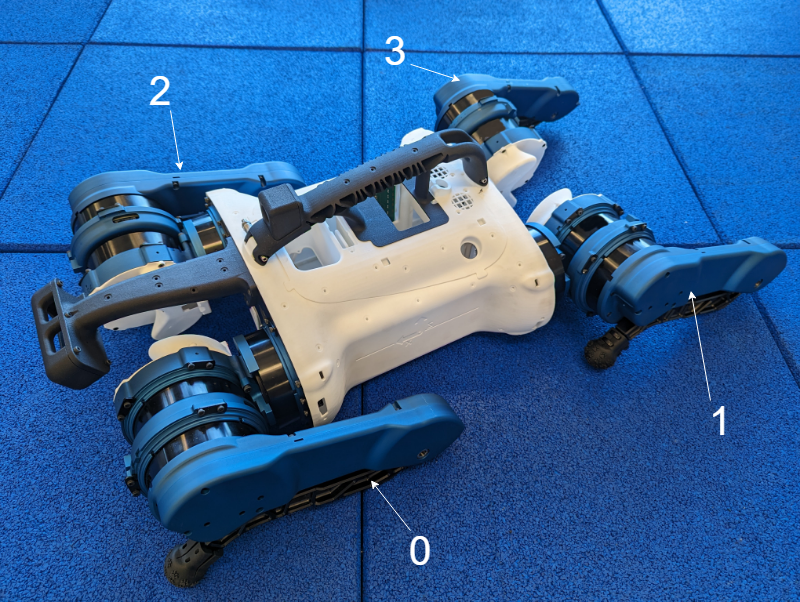

### Joint Order

When referring to the joints/actuators by name is not possible, use the
following joint order: \
abduction = 0, hip = 1, knee = 2

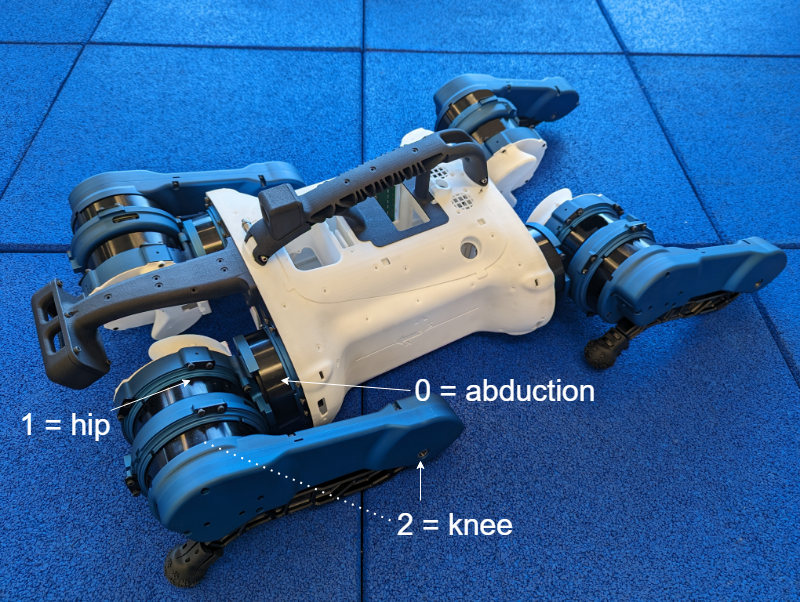

### Combined Leg and Joint Order

When referring to the joints/actuators and legs by name is not possible, use the
joint order in the following table. If not specified, decimal (base 10) numbers
are used.

The actuators are daisy-chained together in a different order on the EtherCAT
bus, but this is transparent to the user as each motor has an alias that matches
the well-known leg and joint order (with 1-based indexing due to EtherCAT
conventions).

Robot Joint Leg Order | Robot Joint Order | Leg abbr. | Name                    | Actuator Physical Position on ECAT chain | Physical Leg Order (ECAT) | ECAT device alias
:-------------------: | :---------------: | :-------: | ----------------------- | :--------------------------------------: | :-----------------------: | :---------------:
0                     | 0                 | "FL"      | "abduction_front_left"  | 0                                        | 0                         | 1
                      | 1                 |           | "hip_front_left"        | 1                                        |                           | 2
                      | 2                 |           | "knee_front_left"       | 2                                        |                           | 3
1                     | 3                 | "HL"      | "abduction_hind_left"   | 9                                        | 3                         | 4
                      | 4                 |           | "hip_hind_left"         | 10                                       |                           | 5
                      | 5                 |           | "knee_hind_left"        | 11                                       |                           | 6
2                     | 6                 | "FR"      | "abduction_front_right" | 3                                        | 1                         | 7
                      | 7                 |           | "hip_front_right"       | 4                                        |                           | 8
                      | 8                 |           | "knee_front_right"      | 5                                        |                           | 9
3                     | 9                 | "HR"      | "abduction_hind_right"  | 6                                        | 2                         | 10
                      | 10                |           | "hip_hind_right"        | 7                                        |                           | 11
                      | 11                |           | "knee_hind_right"       | 8                                        |                           | 12

Here's a visual representation of the ordering above:

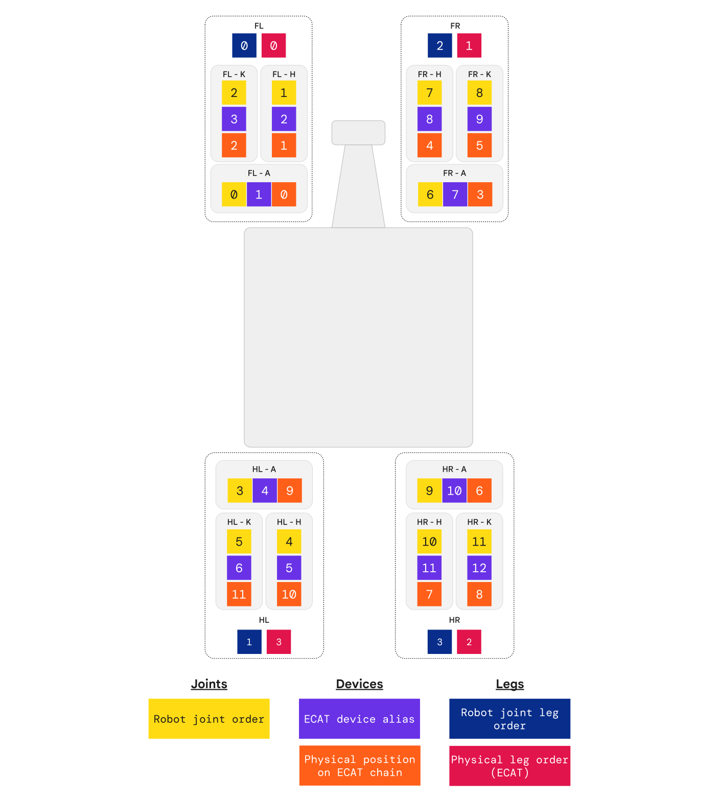

## Barkour Motor Direction Convention

For the individual actuator modules and the associated firmware, the direction
of positive rotation is the rotor moving clockwise with respect to the stator
when looking at the rotor side of the motor. In other words, using the
right-handed rotation convention, the axis of rotation is in the direction from
the rotor towards the stator.

Note: This is not the same as the robot joint directions. There is also no
defined convention for the zero position for a single motor until it is built
into a full robot.

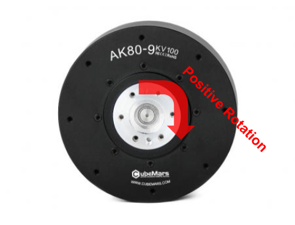

## Barkour Robot Joint--Zero Position

Each joint of the robot has a defined zero position, which is used for control.
The following images show the robot in the configuration where all joints are at
their defined zero positions.

Important: If in doubt, the zero position of the hip joints is such that the
line from the center of the hip pivot to the center of the knee pivot is
horizontal, and the knee joints are fully closed. The “fully closed” knee joint
may look slightly more or less closed than in the following images.

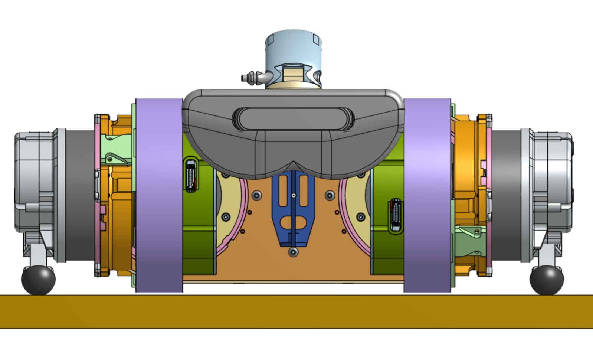

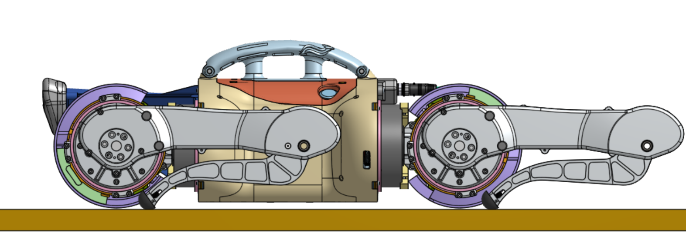

## Barkour Robot Joint Directions

Each joint of the robot also has a defined convention for its positive and
negative rotation directions. The following images describe this convention.

### Abduction Lower Limit (-60 deg)

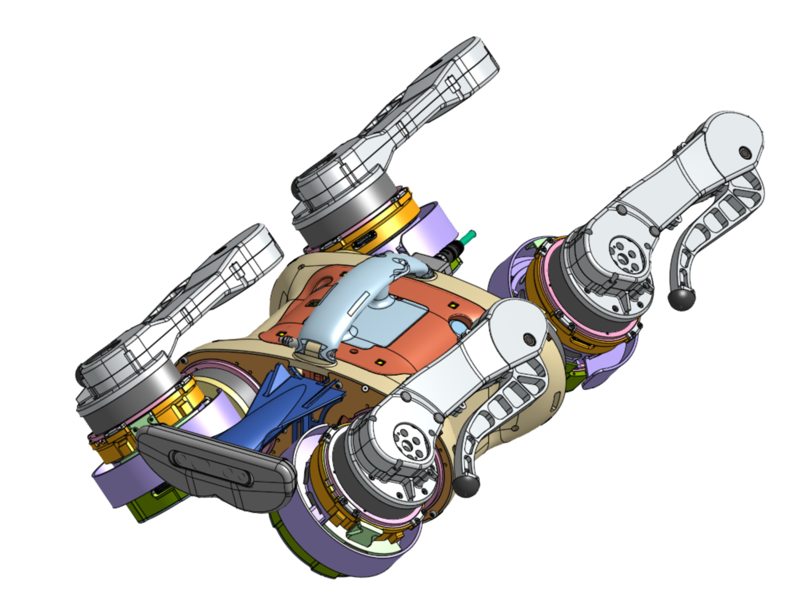

### Abduction Upper Limit (60 deg)

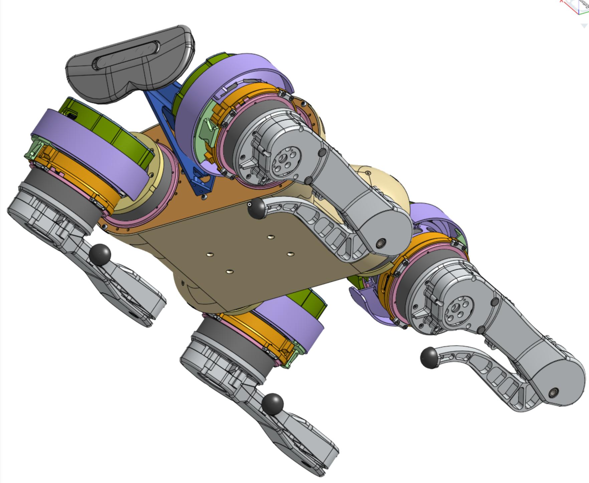

### Hip & Knee

Arrows indicate positive direction.

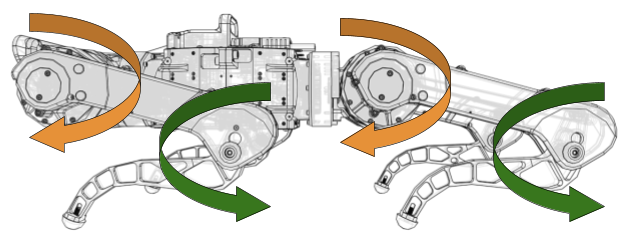

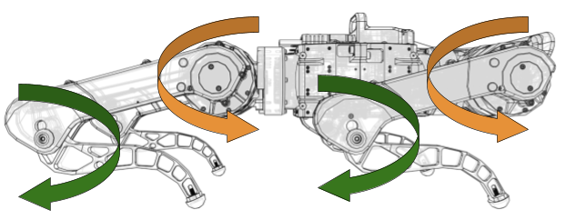

### Relative motor directions for Joints vs Motors

The following table lists the relative signs of the motor and joint rotation for
each joint of the robot. For joints with sign +1, the joint rotation direction
coincides with the motor rotation direction, whereas for joints with sign -1,
the two directions are opposite.

Robot Joint Leg Order | Robot Joint Order | joint_sign | Name
:-------------------: | :---------------: | :--------: | -----------------------
0                     | 0                 | +1         | "abduction_front_left"
                      | 1                 | +1         | "hip_front_left"
                      | 2                 | -1         | "knee_front_left"
1                     | 3                 | -1         | "abduction_hind_left"
                      | 4                 | +1         | "hip_hind_left"
                      | 5                 | -1         | "knee_hind_left"
2                     | 6                 | -1         | "abduction_front_right"
                      | 7                 | -1         | "hip_front_right"
                      | 8                 | +1         | "knee_front_right"
3                     | 9                 | +1         | "abduction_hind_right"
                      | 10                | -1         | "hip_hind_right"
                      | 11                | +1         | "knee_hind_right"

### Hip Range of Motion (-88.447; 173.557)

In the current version, the Range of Motion (ROM) of the hip is the same between
the front and hind legs.

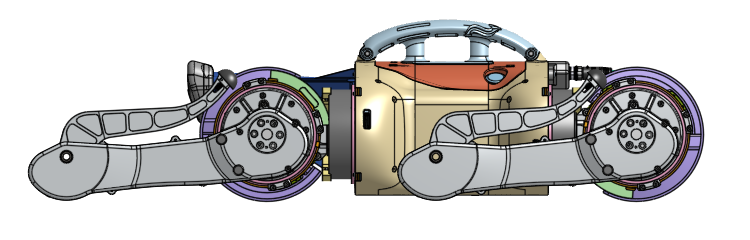

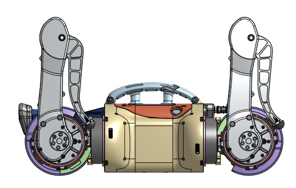

### Knee Range of Motion (0; 140 deg)

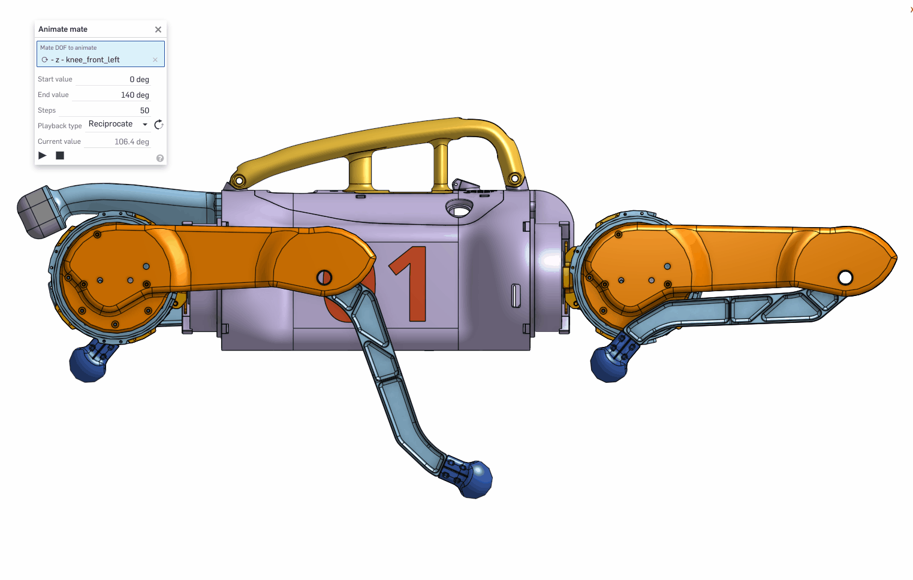

### Summary Table

Front Left | Hind Left | Front Right | Hind Right | Range
:--------: | :-------: | :---------: | :--------: | --------------------------
Abduction  | Abduction | Abduction   | Abduction  | -60 deg to +60 deg
Hip        | Hip       | Hip         | Hip        | -88.447 deg to 173.553 deg
Knee       | Knee      | Knee        | Knee       | 0 deg to 140 deg

## Barkour Robot Joint Position Calibration

As the encoder magnet cannot reliably be placed in a known orientation with
respect to the output shaft for each motor, we require a calibration routine in
order to calculate the correct joint position of the robot at any given time.

The calibration procedure needs to be run just once for each motor on the robot,
and is as follows. The joint is moved to the endstop at the negative end of its
range, that is:

*   Legs fully outwards for the abduction joints

*   Upper legs fully “backward” for the hip joints

*   Lower legs fully “closed” for the knee joints

At this joint position, a command is given to the firmware to store the current
encoder reading in EEPROM and use it as a zero offset when reporting positions
over the EtherCAT bus. See the [firmware documentation](firmware.md) for
instructions on how to send this command.

This means that once this calibration has been completed, the joint positions
can be calculated by:

```
joint_position = relative_motor_direction * motor_position + endstop_offset_from_zero
```

Where the endstop offsets from zero are given by the negative range limit for
each joint.

Front Left | Hind Left | Front Right | Hind Right | Endstop offset from zero
:--------: | :-------: | :---------: | :--------: | ------------------------
Abduction  | Abduction | Abduction   | Abduction  | -60 deg
Hip        | Hip       | Hip         | Hip        | -88.447g
Knee       | Knee      | Knee        | Knee       | 0 deg

### Turn-Count Initialization Strategies

In addition to the procedure described here, since the encoder is single-turn
only and is mounted on the input side of the actuator gearbox, there is a
further homing step required to correctly initialize the turn count each time
the robot starts up. This means that the effective zero offsets used differ from
those listed by some multiple of 360 degrees / gear ratio = 40 degrees.

There are multiple possible strategies for initializing the turn count to the
correct value and the software setup has been designed to allow simple swapping
in and out of different strategies:

1.  Nearest Zero Turn-Count Initialization

    If it is known that the robot has been started with its joints within +/-
    (pi / gear ratio) radians from the correct starting position, using the
    saved offsets it's possible to set the correct zero position for the joints.
    The precondition is easy to verify visually, but if the robot is not near
    the zero position and the user wants to start it, they will need to manually
    intervene and move the joints back to zero.

1.  IMU-based Turn-Count Initialization

    Each of the motor drivers has an on-board IMU on the stator side of the
    motor. This means that by comparing the abduction and hip IMUs, the
    abduction angle may be deduced, and by comparing the hip and knee IMUs, the
    hip angle may be deduced. By combining this with the saved motor offsets,
    the IMUs only need to be accurate enough to deduce the joint angles to
    within +/- (pi / gear ratio) radians, so this strategy should work well,
    with the following caveats:

    *   It cannot work for the knee joint, as there is no IMU on the rotor side
        of the knee.

    *   Due to close proximity with the motor magnets, the IMU magnetometer is
        unlikely to work well, so only the gravity vector can be reliably used
        to detect the joint angle. This should work as long as the joint axis is
        not too close to the gravity direction, but will not give usable results
        if these two axes are aligned.

1.  Endstop Homing

    There's also the option to move the joints to a chosen endstop to find the
    zero position. The downside is that depending on the configuration of the
    robot, it may not be able to freely move its joints to the endstop, or doing
    so could have unintended consequences such as flipping the robot over.

## Orientation (Roll, Pitch, Yaw) and Coordinate Frame

We use the
[Land Vehicle conventions](https://en.wikipedia.org/wiki/Axes_conventions).

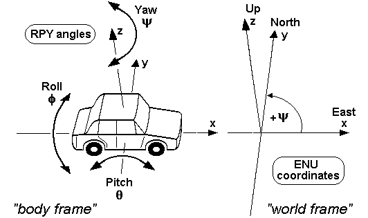

ENU (East North Up) right handed coordinate frame convention with the X (East)
axis along the body of the robot as shown below.

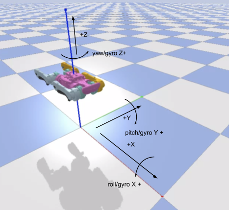

### Base Frame

Origin on the mid plane of the abduction motors (and centred width and length)
between said joints. Orientation with X-forward, Y-left, Z-upwards (i.e. the
aforementioned convention for orientation). IMU and other observations
are to be transformed to this frame. Projection of the frame is printed on the
chassis as shown below.

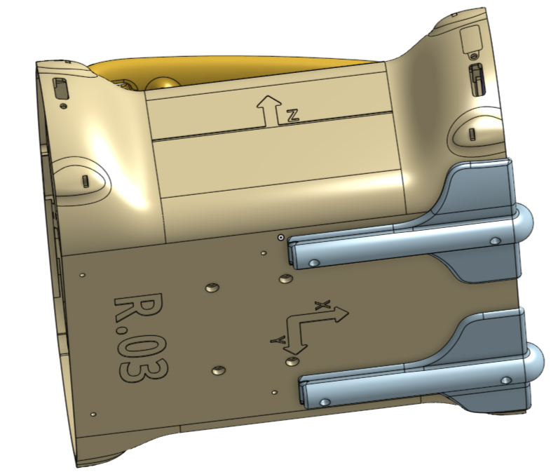

## Actuated Head

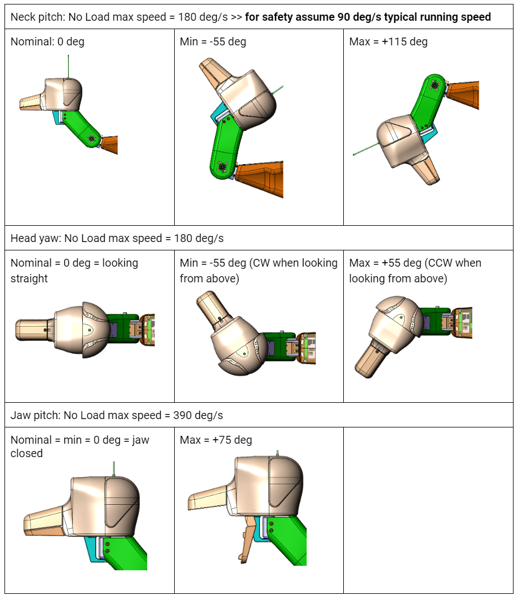
