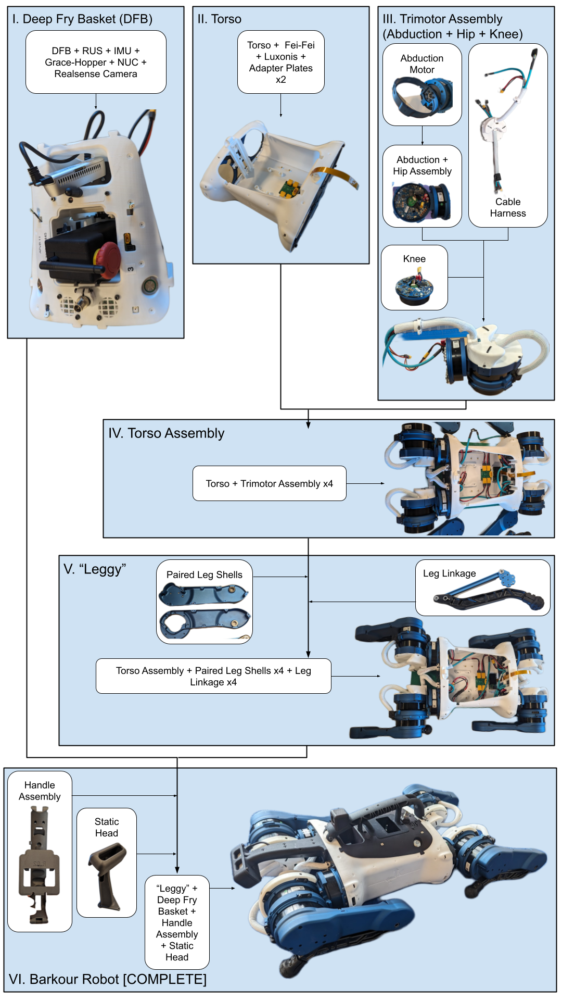
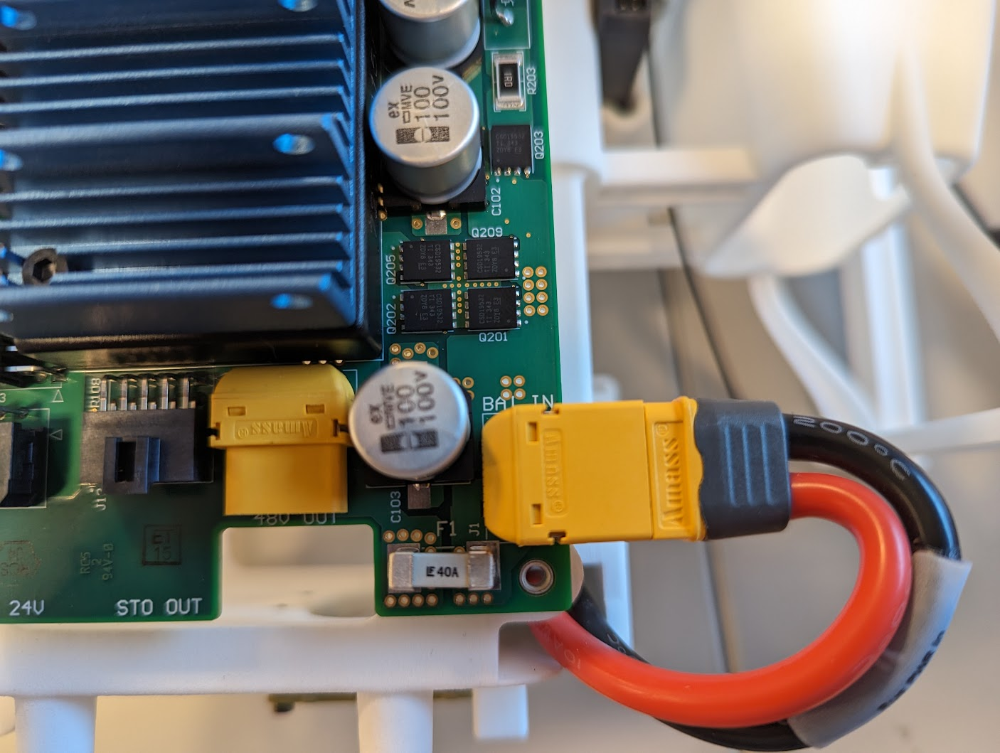
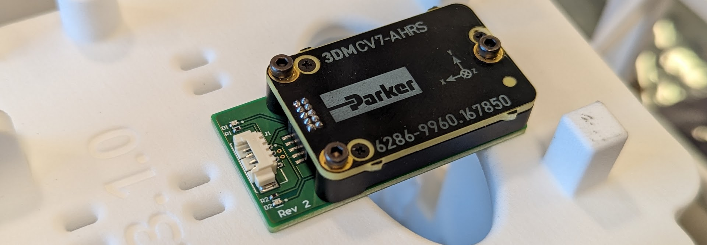
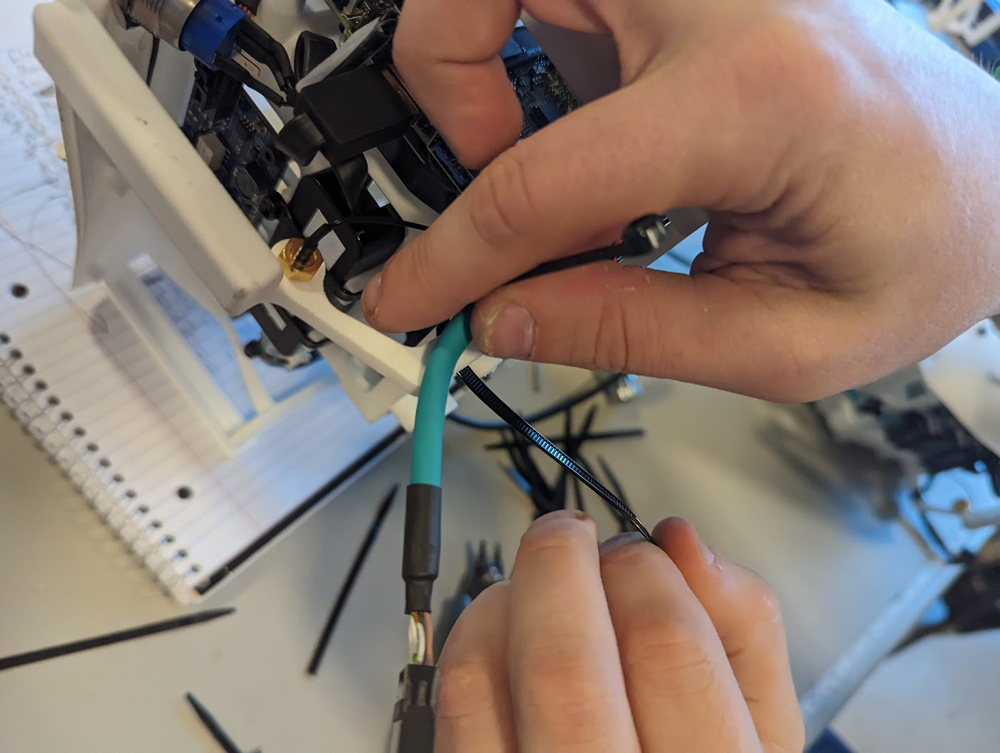
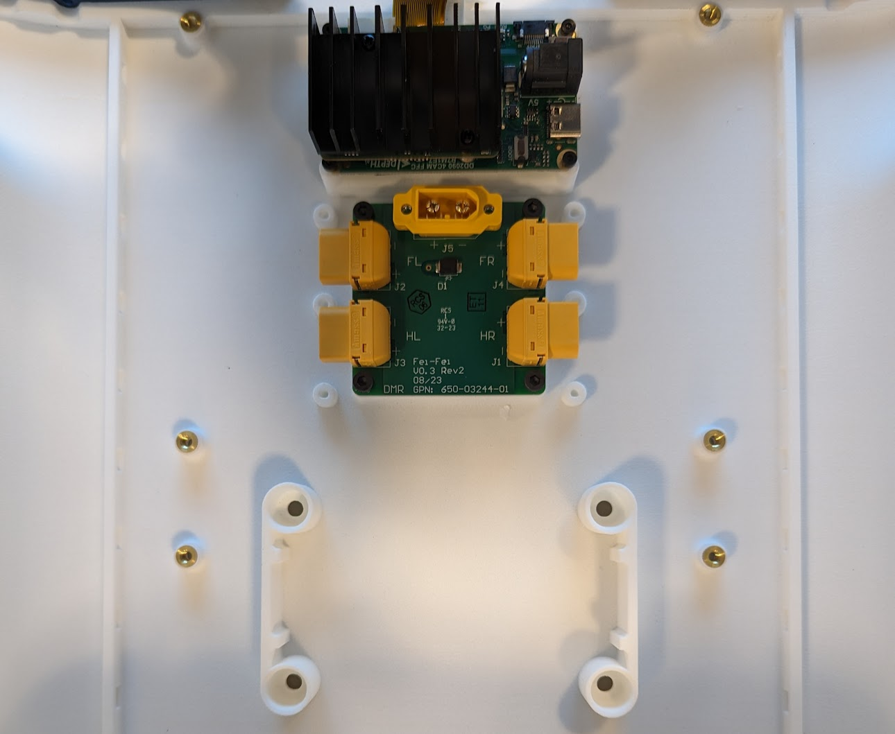
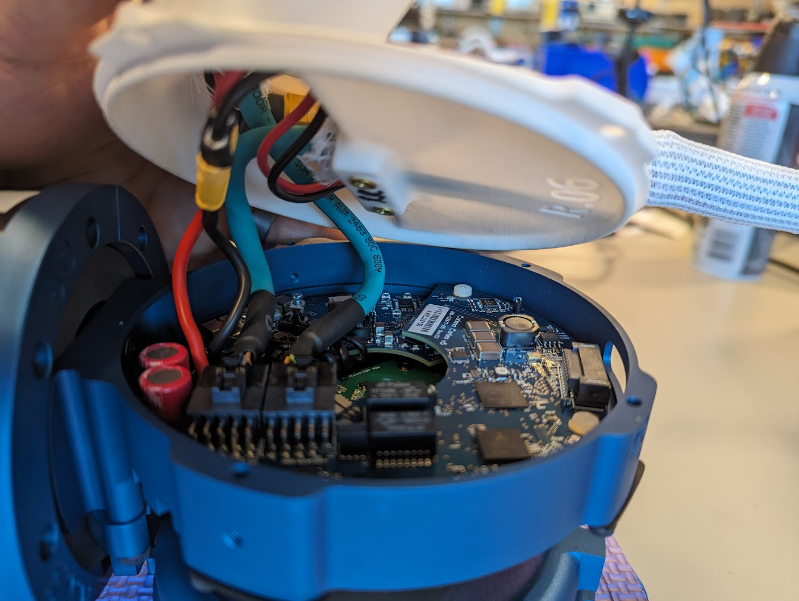
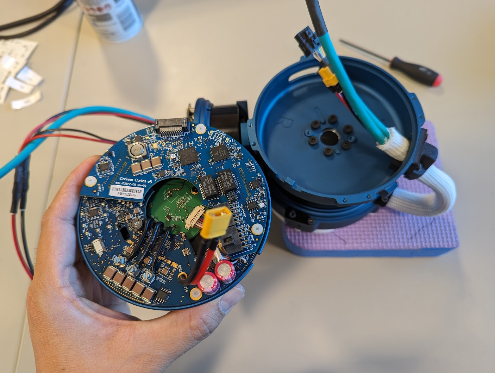
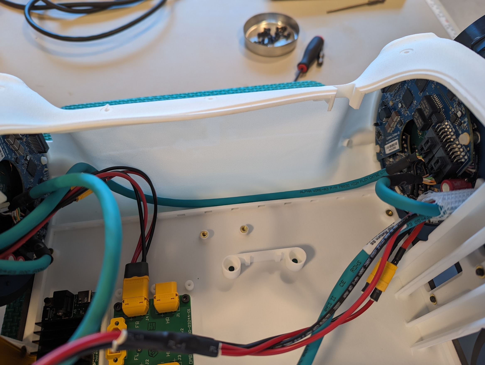

# Full Barkour Robot Assembly

[TOC]

This page describes how to assemble a complete Barkour Robot. ***It assumes that
all relevant preparation steps and sub-assemblies have been completed.***

The guides for the sub-assemblies can be found at these locations:

*   [Actuator assembly and setup](actuator_assembly_and_setup.md)
*   [Hip cover assembly](hipcover_assembly_instructions.md)
*   [Leg linkage assembly](leglinkage_assembly_instructions.md)
*   [Wireless E-stop (STO) assembly](wsto_assembly.md)
*   [IMU configuration](imu_config.md)

Note: If you'd like to build the actuated head variant, first assemble a robot
with a static head (this doc), then follow the
[actuated head assembly](actuated_head_assembly.md) instructions.

## Overview

NOTE: In an attempt to optimize the flow of building the robot and minimize
potential pain-points, we've devised these distinct phases in a recommended
sequence diagram.

1.  **Deep Fry Basket**

    *   In this stage we're bringing together all unique and associated assets
        of a Barkour Robot's electronics basket such as its central compute and
        sensor systems.
    *   Once designated, every part in this assembly should stay together, even
        when displaced into a different robot assembly.
    *   This module does not get its final configuration until the end, due to
        how the camera is mounted via special structure attached to the torso.

2.  **Torso**

    *   This is the "body" upon which four "legs" and "brain" can be grafted.

3.  **Trimotor Assembly**

    *   Three mono-motor sub-assemblies come together to form a specific leg.
    *   There are only FOUR valid configurations:
        *   **FL** \(**F**ront **L**eft\)
        *   **HL** \(**H**ind **L**eft\)
        *   **FR** \(**F**ront **R**ight\)
        *   **HR** \(**H**ind **R**ight\)
    *   The specific hip bracket dictates the **R**ight or **L**eft nature.
    *   And the specific cable harness designates the additional **F**ront or
        **H**ind orientation.

4.  **Torso Assembly**

    *   At this phase we have a completed torso with partially finished "legs".
    *   All "legs" currently terminate at the "knee" actuator and do not have
        shells or proper feet yet.
    *   One of each orientation trimotors is installed and wired in the
        appropriate sequence.
    *   The ECAT chain ordering is further elaborated in the
        [Range of Motions doc](barkour_rom.md).

5.  **"Leggy"**

    *   We attach the rest of the leg linkages and shells to the torso assembly.
    *   This is complete *from a mechanical perspective.*

6.  **Barkour Robot \[COMPLETE\]**

    *   The robot has a complete body with fully-assembled legs.
    *   The "brain" is all wired up and assets are all in their finalized spots.
    *   The assembled robot is ready for software bringup and general use.

## Individual Modules

NOTE: The following three modules are not dependent upon one another and
therefore can be built in-parallel.

### Deep Fry Basket (DFB)

The DFB goes through TWO DISTINCT PHASES during assembly:

*   **PHASE 1** - "Universal"

    *   Mechanically and electrically indistinguishable from one another.
    *   Can be swapped around with minimum fuss.

*   **PHASE 2** - "Designated"

    *   Assigned a specific NUC computer and its associated subcomponents.
    *   These items are explicitly paired with the NUC via software configs.

#### Parts Needed for PHASE 1: "Universal DFB"

| Part Name                  | Quantity | Description & Details                |
| -------------------------- | :------: | ------------------------------------ |
| 3D-printed Deep Fry Basket | 1        |                                      |
| RUS_Power_In               | 1        | Red and black cable bundle with      |
:                            :          : anode and cathode electrodes         :
:                            :          : soldered in a specific orientation   :
| U-shaped Electrode         | 1        | Additional power leads               |
| Battery Holder             | 1        | Part that sandwiches the             |
:                            :          : afforementioned leads in-place with  :
:                            :          : the + and - signs                    :
| M3x8mm SHCS                | 2        | Screw that secures the Battery       |
:                            :          : Holder to the DFB                    :
| RGB Fan                    | 2        | Modified with 2POS nanofit molex     |
:                            :          : connectors                           :
| M3x18mm SHCS               | 4        | Secures fans into the DFB            |
| M3 Nuts                    | 4        |                                      |
| Power_Switch               | 1        |                                      |
| E-stop Antenna             | 1        |                                      |
| Antenna Panel              | 1        |                                      |
| M3x6mm SHCS                | 2        |                                      |
| Rus PCBA                   | 1        | Power distribution board             |
| M3x12mm CSS                | 2        |                                      |
| M3x16mm CSS                | 1        | We need a longer countersunk bolt to |
:                            :          : hold the Rus in-place                :

1.  Install the electrodes.

    A. The black lead is longer than the red one; *you can’t get this wrong
    unless it was soldered incorrectly.*

    

    B. Pressed into the DFB slots in the shown order.

    

    C. Hand-tighten the Battery Holder with the x2 M3x8mm bolts.

    

2.  Install the NUC-cooling fans into the shell.

    A. Each is secured via x2 M3x18mm bolts and nuts. Oriented so they shoot air
    ***upwards and away*** from the robot torso.

    

    

    B. Molex connectors funneled to robot back side right (*it will plug into
    the RUS when it gets there*).

    

    

3.  Install the power button. Confirm the o-ring is present, and then tighten
    the retention nut to feel with pliers.

    

4.  Install the cover with the on-robot E-stop antenna.

    A. Take care not to damage the delicate cable. Route it to the left side
    (*it will plug into the Hopper when it shows up*).

    

    B. Hand-tighten with x2 M3x6mm bolts to the top.

    

5.  Install the RUS power distribution board.

    A. The board mounts to the right side of the DFB with x2 M3x12mm (shorter)
    and a single M3x16 through the center. *We can leave the fourth spot open
    for now and zip-tie it down later.*

    

    B. Top-side ports should align like so:

    

    C. Connect FANS from step #2 into J8 and J9. Then plug in the electrode
    leads from step #1 into the appropriate slot.

    

    

NOTE: Up to this stage, the assembly is a “universal DFB”. But after this phase
this DFB is associated with a specific NUC compute and its associated parts.

#### Parts Needed for PHASE 2: "Designated DFB"

| Part Name                 | Quantity | Description & Details                 |
| ------------------------- | :------: | ------------------------------------- |
| Deep Fry Basket           | 1        | This is what we built up in PHASE 1   |
| Hamilton with IMU         | 1        | Measures IMU data                     |
: Assembly                  :          :                                       :
| M2x16mm SHCS              | 3        | Keeps the IMU secured to the bottom   |
:                           :          : of the DFB                            :
| M2 Locknuts               | 3        |                                       |
| NUC                       | 1        | CENTRAL COMPUTING UNIT FOR THE ROBOT  |
:                           :          : DOGGY                                 :
| Rus_to_NUC                | 1        | Power cable for the NUC               |
| M3x6mm SHCS               | 4        | Secures NUC to the backside of the    |
:                           :          : DFB                                   :
| Hopper PCBA & XBee        | 1        | Remote E-stop mechanism               |
: Transceiver               :          :                                       :
| M3x6mm SHCS               | 4        | Four bolts for securing the Hopper to |
:                           :          : the DFB                               :
| Rus_to_Hopper             | 1        | Cable                                 |
| USB to Ethernet Adaptor   | 1        |                                       |
| NUC_ECAT_DFB              | 1        | Cable                                 |
| USB Panel                 | 1        | 3D-printed part to mount the panel    |
:                           :          : mount cables three USB-C slots        :
| PanelMount_USB_A_to_C     | 1        | Cable                                 |
| PanelMount_USB_C_to_C     | 1        | Cable                                 |
| M3x6mm                    | 2        | Mounts the panel mount into the DFB   |
| Realsense_USB_C_to_C      | 1        | Cable                                 |
| Oak_USB_A_to_C            | 1        | Cable                                 |
| STO_Switch                | 1        |                                       |
| Hip_Return_to_Rus_STO_DFB | 1        | Cable                                 |
| Rus_to_Fei-Fei            | 1        | Cable                                 |
| NUC_Ext_Ethernet_Access   | 1        | Cable                                 |
| IMU                       | 1        | Cable                                 |
| Realsense Camera          | 1        |                                       |

1.  Install the IMU. {value=8}

    A. Secures to the underside of the DFB with x3 M2x16mm bolts and
    complementary nuts.

    

    

2.  Install the NUC.

    A. It's recommended to plug the NUC to RUS power cable in-advance and bend
    it as the port is on the backside of the NUC.

    

    B. Fastens to the backside of the DFB with x4 M3x6mm bolts.

    

    C. Route the power cable to the right-side DFB and plug into the RUS. Take
    caution not to crush the cable or apply pressure to NUC components.

    

    D. Route the antenna cables thusly.

    

    

    E. Plug in the Power Button from step #2 into the NUC.

    NOTE: *Some* of the power buttons cables still have all eight pins. Make
    sure the top two pins are exposed as demonstrated to prevent damaging the
    NUC.

    

    F. Apply additional zip-ties for strain-relief and cable-management.

3.  Install and connect the Hopper and XBee:

    A. Install the Hopper PCBA to the left side of the DFB with x4 M3x6mm bolts.

    

    B. Plug it into the XB (wireless transceiver) on top. *Take care not to bend
    the delicate pins!* Plug in the STO antenna from step #4.

    

    

    C. The Rus_to_Hopper cable (*grey cable*) goes around the backside of the
    DFB and across the heat-sink into the Rus PCBA.

    

    

    

4.  Install the NUC's USB to Ethernet adaptor and the outgoing ECAT. {value=11}

    A. Zip-tie the Ethernet adaptor in-place and plug it into the NUC.

    

    

    B. Plug in the NUC_ECAT_DFB cable (*three-headed split cable*) into the
    Ethernet adaptor dongle and snake it around the front of the DFB and across
    the Rus heat-sink into the appropriate slot.

    

    

    C. Apply additional zip-ties for stability, strain-relief, and improved
    cable management.

5.  Install the USB Panel Mount plate and its associated cables.

    

    A. The Panel Mount fastens into the DFB with x2 M3x6mm bolts.

    

    B. The other ends of the panel mount connectors go across the RUS heat sink
    and plug into the NUC.

    

    C. Zip tie the cables lying across the heat sink and to keep the bundles
    together.

    

6.  Install the STO button, tighten the retention nut, and plug it into the 'STO
    But' port on the Rus.

    

7.  Install the Rus outward-bound STO ECAT cable.

    A. Hip to RUS STO DFB 20B (*longest blue ECAT cable*) plugs into the Rus STO
    line as shown...

    

    B. ...loops over the NUC...

    

    C. ...around the DFB backside until it is anchored on the DFB left side.
    

    

8.  Install the RUS to FeiFei power cable and zip-tie the parallel bundles
    together.

    

9.  Install the Ethernet Access port.

    A. Kept in-place with x1 M3x20mm and nut. *The cable will “push” adjacent
    cables and keep them under tension so they don’t fall into the fans.*

    B. Plugs into the remaining NUC Ethernet port on the right side of the DFB.
    

10. Wiring up the IMU.

    

11. Finalizing antenna placements and angle upward. {value=18}

    

    

### Torso

#### Parts Needed

| Part Name             | Quantity | Description & Details                     |
| --------------------- | :------: | ----------------------------------------- |
| Torso                 | 1        |                                           |
| Luxonis Board         | 1        | USB camera controller and driver          |
| OAK FFC Cable         | 1        | Ribbon cable connecting Luxonis Board and |
:                       :          : Oak Camera module.                        :
| Fei-Fei PCBA          | 1        | Power distribution board; v0.3 Rev2; GPN: |
| M3x5mm SHCS           | 4        | Larger bolts for the Fei-Fei              |
| Combined Face Plate   | 2        | Horizontal cross-section of the torso     |
:                       :          : shell; covers the front and back side     :
| Leg Retention Washers | 4        | Blue steel open-ended rings that provide  |
:                       :          : cleat-attachment structure                :
| M4x16mm BHCS          | 14       | Rounded cap screws for attaching endcap   |
:                       :          : plates to chassis                         :
| M4x22mm SHCS          | 8        | Long bolts                                |
| M4 Square Nuts        | 8        | Square nuts that go with the 22mm long    |
:                       :          : bolts                                     :
| M2x5mm SHCS           | 4        | Smaller diameter bolts for Luxonis        |

1.  Starting with an empty chassis shell:

NOTE: Confirm the M4 heat-inserts are pre-installed and mounting holes should be
tapped and reamed in-advance.

1.  Install the Luxonis board: {value=2}

    

    A. Plug the ribbon cable into the CAMB-2L slot on the backside of the PCBA.

    

    B. Ribbon cable is snaked through the frontside torso channels like so.
    **Carefully bend the FRC, making sure you don't damage the delicate cable.**

    

    C. Bolt the PCBA down with x4 M2x5mm bolts until finger-tight.

2.  Install the FeiFei board:
    

    Note: The images below show an older variant of the Fei-Fei board without
    connectors to power the actuated head. If you are planning to use the
    actuated head, make sure to install a Fei-Fei board with spare XT30
    connectors.

    A. Position the FeiFei board at its designated location in the torso.
    

    B. Secure the board with x4 M3x5mm thread-forming bolts until finger-tight.

NOTE: Confirm final positions of the both Luxonis & Fei-Fei before proceeding.

1.  Install the Combined Face Plates. {value=4}

    A. Align the face plate to the front/back of the torso, and use x4 M4x22mm
    long bolts and their respective square bolts on the outer edges.

    B. Use x7 M4x16mm button-headed bolts to fasten the plate's center-mass to
    the torso.

    C. Perform the same action for the other side of the torso.

Note: For installing the static and actuated head, three M4x16 bolts on the
front face will need to be removed. See above pic.

NOTE: Example of a completed Torso Assembly ready to be populated.

### Trimotor Assembly

Three "mono motors" combine to form the 1. Abduction, 2. Hip, and 3. Knee joint
for a trimotor.

*In a later section,* four different trimotors, each built up to one of four
specific orientations (FR, FL, HL, & HR) forms the quadruped.

There's a lot of overlapping parts and fasteners, so for clarity of process
we'll separate this into THREE DISTINCT PHASES; each adds another component onto
the previous phase, making it more complete as we go along.

1.  **PHASE 1** - "Build Abduction Joint"
2.  **PHASE 2** - "Add Hip Motor"
3.  **PHASE 3** - "Install Cable Harness & Attach Knee"

#### Parts Needed for PHASE 1: "Build Abduction Joint"

| Part Name      | Quantity | Description & Details                          |
| -------------- | :------: | ---------------------------------------------- |
| Completed      | 1        | Assembled and calibrated via these             |
: "Monomotor"    :          : [instructions](actuator_assembly_and_setup.md) :
: Assembly       :          :                                                :
| Abduction Hip  | 1        | Ring-like metal piece                          |
: Bracket        :          :                                                :
| 3⌀3x5mm dowel  | 4        | x2 to hold the hard stop block in place and x2 |
: pins           :          : more that will index us onto the abduction     :
:                :          : motor                                          :
| Bracket End    | 1        | Machined metal piece; complement to the        |
: Stop Block     :          : ring-like bracket piece                        :
| M4x16mm SHCS   | 2        | Bolts for securing the end stop block to the   |
:                :          : bracket input                                  :
| Thrust         | 1        | Matte grey plastic ring that sits between the  |
: washer/bearing :          : hip bracket and the abduction                  :
| Blue steel     | 1        | Another component of the physical hardstop     |
: crescent part  :          :                                                :
| M3x5mm SHCS    | 4        | Secures the endstop onto the abduction motor's |
:                :          : outer ring                                     :
| M4x8mm SHCS    | 6        | Secures bracket into the abduction motor       |

#### Procedure: "Build Abduction Joint"

1.  Combine the abduction bracket with its physical end stop.

    

    A. Press x2 pins into the two smooth bore openings on the hip bracket.
    *These will keep the end stop piece in-place.*

    

    B. Install the remaining two pins onto the "underside" of the abduction
    bracket using the custom fixture. *These will be additional anchors to keep
    the motor secured.

    
    

    C. Place the end stop, indexing with the smooth holes atop of the previously
    installed dowels.

    D. Start working x2 M4x16mm bolts into place with some Loctite 243 (*blue*)
    and then torque them down to 3nM.

    

2.  Install the hard stop piece to a trimotor.

    A. Place the spacer/washer in-place before securing the hard stop. **DO NOT
    FORGET THIS PIECE!**

    

    B. Line up the notches on the monomotor and the hard stop crescent piece as
    demonstrated.

    
    

    C. Apply 243 Loctite (*blue*), install x4 M3x5mm bolts, and torque to 2Nm.

3.  Attach a completed abduction bracket to the prepared mono-motor.

    A. Line up the pins on the bracket underside and openings on the motor
    topside as shown.

    

    B. Confirm the relative positions of the end stop piece and the hard stop
    crescent to ensure the motor has a full range of motion.

    

    C. Install x6 M4x8mm bolts to hold the bracket in-place atop of the washer
    (*strongly advised to use a ball-tipped hex driver*) with Loctite 243
    (*blue*).

    D. Torque to 3Nm; once in a star pattern and then around the world just to
    be certain it's secured.

Note: **CHECKPOINT #1** - Finished the Abduction Motor Joint. Manually rotate
the joint from end-to-end to confirm smoothness of motion.

#### Parts Needed for PHASE 2: "Add Hip Motor"

| Part Name               | Quantity | Description & Details                   |
| ----------------------- | :------: | --------------------------------------- |
| Abduction Motor Joint   | 1        | Complete sub-assembly from PHASE 1      |
| M3x8mm SHCS             | 8        | Bolts for the "cleat" system            |
| Cleats                  | 4        | Metal tabs used to secure motors and    |
:                         :          : allow ease-of-service                   :
| Thrust Bushing          | 1        | Matte grey plastic ring that keeps the  |
:                         :          : joint flush                             :
| Left/Right Output Plate | 1        | Designates a trimotor assembly as a     |
:                         :          : Left or Right leg                       :
| ⌀3x5mm dowel pins       | 2        | Used as an indexing feature for the L/R |
:                         :          : output plate                            :
| M4x8mm SHCS             | 6        | Secures output plate into hip motor     |

#### Procedure: "Add Hip Motor"

1.  Install another single motor onto the abduction motor assembly. This will
    serve as the HIP MOTOR.

    A. Line up the assets as demonstrated.

    

    B. One indexing feature is the board cluster port on the monomotor and the
    opening on the abduction bracket output.

    

    C. Tabs should line up as shown.

    

2.  Secure hip using the CLEAT system as explained.

    A. x4 cleats and x8 M3x8mm bolts (*no loctite needed; often disassembled*).
    

    B. These are torqued to 2 Nm and oriented so that the metal tabs move
    clockwise, applying force into the motor circumference.

    

3.  Assigning "leggedness" with the appropriate knee output plate.

    

    A. Before installation, place another washer on top of the hip motor output;
    *this will keep the plate level and rotating smoothly.

    

    B. Output plate should be pinned with the same 3x5mm's we've been using.

    

    C. Line up the pins on the output plate with the smooth bore holes on the
    hip motor. Make sure the endstops allow for full range-of-motion as shown.

    

    D. Plate is bolted onto the motor shaft with M4x8mm x6 and Loctite 243
    (*blue*). Torque in a star-pattern to 2Nm.

    

NOTE: **CHECKPOINT #2** - Side view of an Abduction and Hip Two-Motor Assembly.
*At this stage the apparatus has been designated either a Right or Left leg and
should be clearly marked accordingly.*

#### Parts Needed for PHASE 3: "Install Cable Harness & Attach Knee"

| Part Name                                       | Quantity | Description  |
:                                                 :          : & Details    :
| ----------------------------------------------- | :------: | ------------ |
| Abduction + Hip Two-Motor Assembly              | 1        | Designated a |
:                                                 :          : Left or      :
:                                                 :          : Right leg in :
:                                                 :          : the previous :
:                                                 :          : phase        :
| Cable Harness aka [hip                          | 1        | Needs to     |
: cover](hipcover_assembly_instructions)          :          : match the    :
:                                                 :          : L/R          :
:                                                 :          : designation; :
:                                                 :          : determines   :
:                                                 :          : front or     :
:                                                 :          : hind         :
:                                                 :          : orientation  :
| Additional                                      | 1        | This will be |
: [**monomotor**](actuator_assembly_and_setup.md) :          : the knee     :
:                                                 :          : actuator     :
| M3x8mm SHCS                                     | 14       | x8 go to the |
:                                                 :          : cleat        :
:                                                 :          : system; x4   :
:                                                 :          : to attach    :
:                                                 :          : hip cover,   :
:                                                 :          : x2 to the    :
:                                                 :          : knee gland   :
| "Cleats"                                        | 4        |              |

WARNING: Advised to place the two-motor assembly onto something soft (*e.g. yoga
foam, as shown in the visual aid*) during installation procedure in order to
avoid damaging the various electrical components.

#### Procedure: "Install Cable Harness & Attach Knee"

1.  Install the hip cover.

    WARNING: Confirm that both the two-motor assembly and the hip cover are the
    same Left or Right orientation before proceeding. Also, MARK THE ASSEMBLY on
    the outside so you know it's final designation as a Front or Hind leg.

    

    A. Plug the cables that run into the cover into the hip boards. Make sure
    that the ECAT cable labelled "I" goes into the Cortes **I**nput and "O"
    plugs into **O**utput, respectively.

    

    B. Orienting ECAT and power cables to minimize pinching and/or damaging the
    PCBA!

    

    C. Secure cover to output shell with x4 M3x8mm bolts tightened by hand.

    

2.  Plug in the Abduction motor Power and Cortes Output only! *This PCBA will
    face **into** the torso when we start attaching legs in a later step.*

1.  Install the knee motor. {value=3}

    A. Secure the knee gland that runs out from the hip cover onto the knee
    output shell/plate with x2 M3x8mm bolts to hand-tightness.
    

    B. Feed the cables through the hole and towards where the knee motor will be
    installed.
    

    C. Plug the knee Cortes power along with the ECAT Input and Output.
    

    D. Maneuver the cable bundle so it's not crushing any board components or
    twisting the cables beyond a reasonable amount.
    

    E. Output plate and motor heat sink have corresponding tabs that only allow
    one way for the components to mate.
    

    F. Secure the knee motor with the cleat system x4 and the last required x8
    M3x8mm bolts.

NOTE: CHECKPOINT #3: Fully Completed Trimotor with Cable Harness Assembly. Once
the harness is installed, we have finalized Front or Hind leg orientation on top
of Right or Left nature from the previous phase.

## Combining Modules

### Installing Trimotors

#### Parts Needed

| Part Name               | Quantity | Description & Details                   |
| ----------------------- | :------: | --------------------------------------- |
| Barkour Torso Assembly  | 1        | Populated with power and camera PCBAs;  |
:                         :          : output plates installed                 :
| Trimotor Assembly       | 4        | One configured for **F**ront **L**eft   |
:                         :          : (FL), **F**ront **R**ight (FR),         :
:                         :          : **H**ind **R**ight (HR), and **H**ind   :
:                         :          : **L**eft (HL)                           :
| Cleats Retention System | 16       | Secures the leg to the torso output     |
:                         :          : plate                                   :
| M3x8mm SHCS             | 40       | x32 Bolts reserved for the cleat        |
:                         :          : system; each metal tab requires x2 to   :
:                         :          : secure. Remaining x8 are used to attach :
:                         :          : the leg cable grommets into the torso.  :

> Note: Staging the front and rear leg pairs so we can better visualize how it's
> all coming together. Front Left is first in line and will plug into the Deep
> Fry Basket. These elements are closer to the power distribution board and
> thusly have shorter power cables.

> 

> Hind legs will complete the circuit back into the DFB. These have the longer
> power cables because they have to travel farther to reach the Fei-Fei PCBA.
> Hind Left is the last trimotor in the chain.

> 

#### Procedure

1.  Attach the **Front Left** Trimotor.

    A. This plugs directly into the DFB and is therefore is the first "leg" on
    the device chain.

    B. Take note of the orientation of the grommet cable bundle coming from the
    trimotor and how it slots into the torso.
    

    C. Secure the torso grommet to the designated slot with x2 M3x8mm bolts.

    D. Use the cleat system to keep the leg attached to the torso. Each leg
    takes x4 of the metal tabs and x8 M3x8mm bolts. Torque all to 2Nm.

    E. It should look like the example below.

    

2.  Connecting the **Front Right** Trimotor.

    A. Mount and secure the trimotor using the same channels as before to align
    the torso; *it should be the same as FL but mirrored*.

    

    B. Plug the outgoing SS (**S**ame **S**ide) cable from the FL (*see previous
    step #1*) into the FR abduction Cortes Input slot.

    C. Plug in the FL and FR Fei-Fei connectors into the power distribution
    board; *their designations are clearly marked on the PCBA.*

    

3.  Moving down to the **Hind Right** Trimotor.

    A. Slot in the torso grommet and secure trimotor to torso with the same
    aforementioned cleat system.

    

    

    B. Plug the outgoing OS (**O**pposite **S**ide) cable from the FR (*see
    previous step #2*) into the HR abduction Cortes Input.

    

    C. Plug the longer Fei-Fei cable into the power distribution board, as
    shown.

    

4.  Finishing installation with **Hind Left** Trimotor.

    A. Seat, cleat, and complete the HL leg into the torso.

    

    B. The outgoing SS (**S**ame **S**ide) cable from HR (_see previous step #3
    _) travels BEHIND the scaffolding as shown before plugging into the HL
    Cortes Input.

    

    

    C. Fourth verse, same as the last three: plug HL into power distribution. We
    should now have a complete & unbroken ECAT chain from FL that runs
    counter-clockwise all the way to HL.

> NOTE: Now we're ready to attach the rest of the legs onto the robot. **SECURE
> INTERNAL WIRING BEFORE CONTINUING** with some zip ties, as shown.
>
> Location 1: *inside the torso, by the FL trimotor's abduction Cortes*
> 
> Location 2: *FR's outgoing OS cable*
> 
> Location 3: *robot right side internal rail*
> 

### Completing the Legs

#### Parts Needed

| Part Name  | Quantity   | Description & Details                              |
| ---------- | :--------: | -------------------------------------------------- |
| Torso      | 1          | Assembled Torso with all four attached & wired     |
: assembly   :            : trimotor assemblies                                :
| Leg        | 4          | Basically the "thigh, calf, and foot" analog for   |
: linkages   :            : the robot; you need x2 **L**eft designation and x2 :
:            :            : **R**ight designation for a full assembly; [refer  :
:            :            : to sub-page for assembly                           :
:            :            : instructions](leglinkage_assembly_instructions.md) :
| Inner      | 4 (2 left  | Serves as the frame to connect the leg linkage     |
: Thigh      : & 2 right) : into a knee motor.                                 :
: Shell      :            :                                                    :
| Outer      | 4 (2 left  | Complementary "shell" piece that will enclose the  |
: Thigh      : & 2 right) : leg linkage.                                       :
: Shell      :            :                                                    :
| Knee half  | 4          | Connects lower leg to thigh shells.                |
: pin        :            :                                                    :
: cleareance :            :                                                    :
| Knee half  | 4          | Connects lower leg to thigh shells.                |
: pin tapped :            :                                                    :
| ⌀3x5mm     | 20         | Every outer shell gets x5; used as additional      |
: dowel pins :            : indexing to keep the shell pairs secured.          :
| M3x6mm     | 32         | Fastens the inner R/L thigh shell onto the         |
: SHCS       :            : corresponding R/L knee output; x8 per leg.         :
| M4x8mm     | 24         | Secures leg linkage crank into the knee motor      |
: SHCS       :            : output; x6 per leg.                                :
| Bumper     | 4          | Rubber pad to protect against shell-on-shell       |
:            :            : violence.                                          :
| M3x20mm    | 12         | Holds the inner and outer shells together; x3 per  |
: SHCS       :            : leg.                                               :
| M3x10mm    | 20         | Same as above; x5 per leg.                         |
: SHCS       :            :                                                    :
| M5x40mm    | 4          | Secures the knee half pins.                        |
: FHCS       :            :                                                    :

#### Procedure

1.  Press x5 dowel pins into the designated holes in the outer thigh shell with
    some Loctite 243 (*blue*) for additional stability.

    

2.  Secure the inner shell onto the knee motor output.

    A. Place the inner thigh shell onto the knee motor.

    

    WARNING: For alignment, line up the notches on the thigh inner shell with
    the notches on the heatsink. **There are specific details for whether the
    leg is in the Front or Hind region!**

    

    B. Once placements are finalized, apply Loctite 243 (*blue*) and install
    with x8 M3x6mm screws around the perimeter of the motor and torque to 2Nm.

    

3.  Install the appropriate Right or Left linkage into the motor and shell.

    A. Place the linkage on the thigh and motor, making sure the dowel pins are
    aligned with the holes on the face of the motor, and the slot on the crank
    is aligned with the slot in the motor. Apply Loctite 243 (*blue*) and
    install onto the motor inner-ring with x6 M4x8mm bolts torqued down to 3Nm.

    

    C. Ensure full-range of motion from one hard stop to the other before
    proceeding to the final steps.

    Leg fully extended                                                                | Leg fully closed
    :-------------------------------------------------------------------------------: | :--------------:
    {width=70%'} | {width=80%'}

4.  Secure the outer motor plate.

    A. Place a rubber bumper stop into the inner thigh at the provided slot.

    

    

    B. Align and press the outer & inner thigh shells to make sure everything
    lines up. Then install with x3 M3x20mm bolts to finger-tightness in order to
    keep the halves together, but allow for ease of service.

    

    C. On the backside, further secure halves together with x5 M3x10mm bolts,
    once again, to finger-tightness. This leg is now fully assembled.

    

5.  Fasten the knee.

    A. Adjust the lower leg so that the flanged ball bearing is centered with
    the outer shell knee holes.
    {width=40%'}

    B. Slot in the tapped and clearance half pins into the knee hole and fasten
    with an M5x40mm hex flathead bolt.

    Knee Pin Clearance                                                              | Knee Pin Tapped
    :-----------------------------------------------------------------------------: | :-------------:
    {width=90%'} | {width=70%'}

6.  Repeat steps 1 through 5 for each of the leftover leg designations
    {value=5}.

> NOTE: It should look like this after all four legs have been assembled.
>  All legs
> should have full range-of-motion on all joints
> 
> Take notice the cable management and ensure no exposed connectors or stray
> cables are left unsecured inside the torso.
> 

### Final Assembly

#### Parts Needed

| Part Name                 | Quantity | Description & Details                 |
| ------------------------- | :------: | ------------------------------------- |
| Assembled Torso           | 1        | A *mostly complete* Barkout Robot     |
:                           :          : with all four trimotors attached and  :
:                           :          : wired into the torso along with leg   :
:                           :          : extensions                            :
| Assembled Deep-Fry Basket | 1        |                                       |
| Handle                    | 1        | Means to carry the Barkour Robot      |
| Handle Pin                | 2        | Keeps the handle secured to the torso |
:                           :          : and prevents the DFB from escaping    :
| Neck                      | 1        | 3D-printed extension for the neck;    |
:                           :          : houses the outgoing USB cable         :
| M4x16mm BHCS              | 1        | Fastens the output plate into the     |
:                           :          : torso heat insert                     :
| M4x20mm BHCS              | 3        | Secures the neck into the torso       |
| Head                      | 1        | 3D-printed bracket that holds the USB |
:                           :          : camera in-place                       :
| M3x8mm SHCS               | 12       | Securing the head/face plate onto the |
:                           :          : neck once the usb camera is           :
:                           :          : installed; also for the secondary     :
:                           :          : camera block to the handle            :
| OAK camera                | 1        | Cube-shaped camera that plugs into    |
:                           :          : the Luxonis PCBA with a ribbon cable  :
| Camera mount              | 1        | Cubicle-like mount for the OAK camera |

#### Procedure

1.  Installing the Deep Fry Basket (DFB) into the "Leggy" Torso.

    A. Align the two assets as shown, using the four indexing tabs.

    

    B. Plug in the ECAT chain. The front side of the DFB has an outgoing
    receptacle that plugs into the abduction Cortes on the **F**ront **L**eft
    trimotor assembly. The backside of the DFB (*consult visual aid*) receives
    the last connection from **H**ind **L**eft hip return, completing the STO
    loop.

    

    C. Plug in the Luxonis USB and RUS to Fei-Fei power cables.

    

    D. Ensure that the ribbon cable from the Luxonis board has an unobstructed
    path out of the torso. *This will become relevant later.*

    

    E. Slide the basket into the torso, making sure no cables are pinched in the
    process. ***It should sit flush with the rest of the torso shell.***

2.  Installing the Neck (*and Head*).

    

    A. Neck will be mounted onto the front-side output plate as shown:

    

    B. First, use a single M4x16mm bolts at position 4 (*it will be unreachable
    once the neck is installed in the next phase.*)

    C. Then put the 3D-printed neck piece in-place and bolt it down down with x3
    M4x20mm bolts (*longer*) at positions 1-3.

    

3.  Finalizing placement of the head and camera.

    A. The DFB has an outgoing USB-C cable that snakes through an opening in the
    neck frame.

    

    

    B. It will interface with the camera at an angled connector, as shown in
    isolation.

    

    C. Fasten the faceplate over the camera and onto the neck output with the x8
    M3x8mm bolts.

    

    

4.  Attaching the handle and secondary camera.

    A The ribbon cable from the Luxonis board will snake through the sole
    opening in the handle and towards the secondary camera installed on the
    handle.

    

    B. Install the camera into its 3D-printed shell and then fasten to the
    handle with x4 M3x8mm bolts.

    C. Line up the hole on the handle and the torso shell before using both
    pinions to secure it in-place.

    

> NOTE: View of the final assembly:
> 
>
> 

## Starting Up the Robot

Plug in a battery pack into the slot in the deep fry basket.

1.  Remove one (or both) of the handle pinions in order to access the slot for
    power.

2.  Slot in a Dewalt battery pack, making sure the leads line up.
    

3.  The robot should power on without needing to press the power button.
