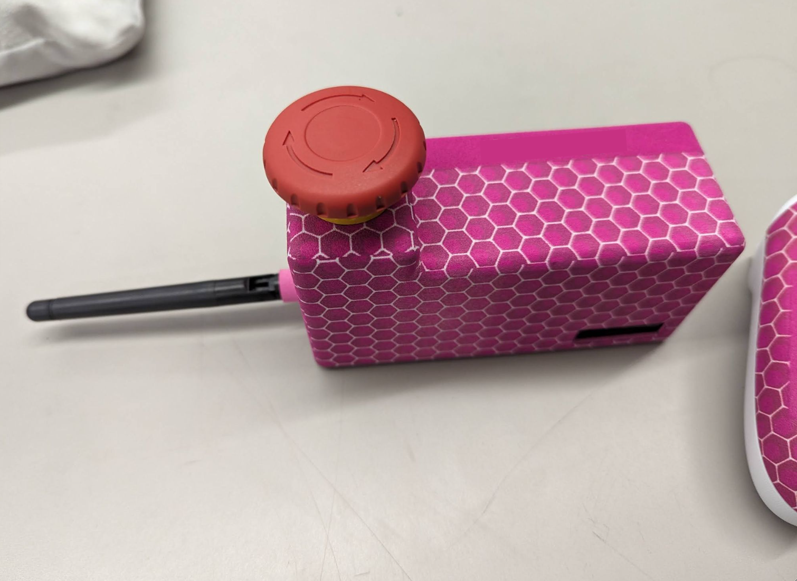
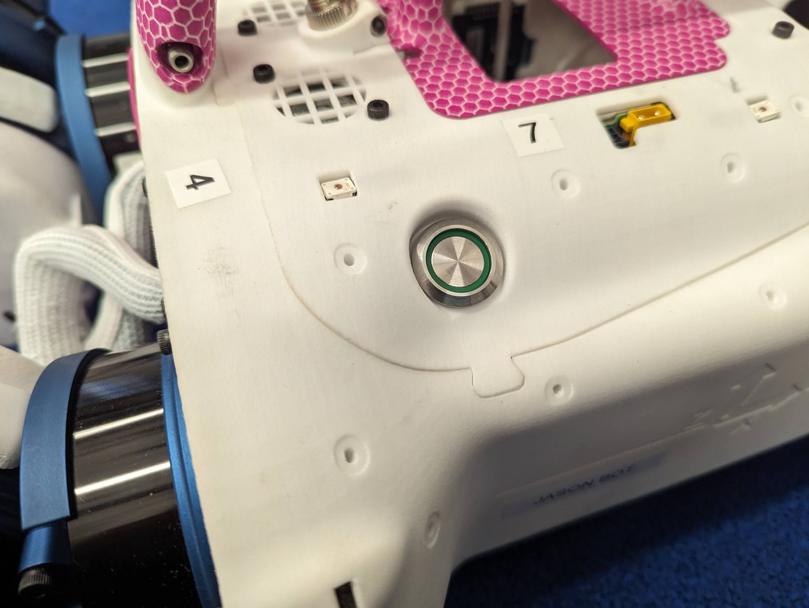
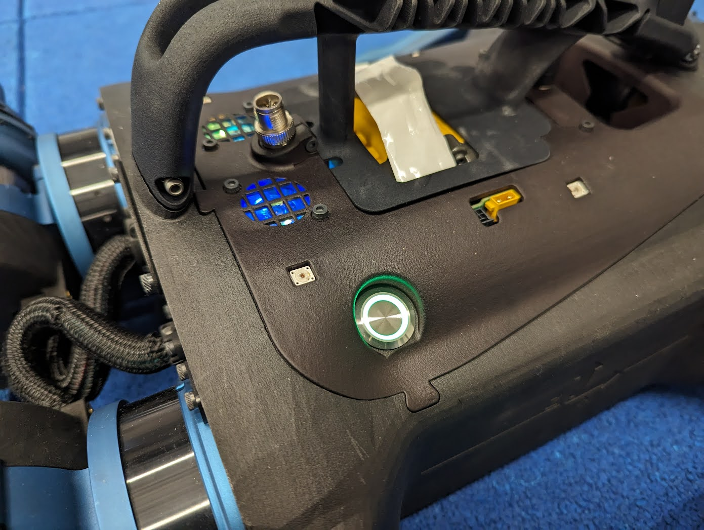

# Getting Started with the Barkour Robots

### STO (Safe Torque Off/E-Stop)

Each robot has two E-stops connected in series: a wireless E-stop (big red
button) and a button on the robot (green light). To enable torque, the red
button must be disengaged (twist it to make it pop up) and the STO button on the
robot must be pressed in. If these conditions are met, the light inside the STO
button on the robot will light up. If the green light on the robot is on, the
torque is enabled (i.e. robot can move).

IMPORTANT: The wireless STO should always be engaged (*i.e. pushed in*) whenever
the robot is not in active use (*e.g. before or after an experiment, or while
you take a break, etc.*).

USAGE NOTES:

1.  Prioritize pressing the red external button for safety purposes.

    

2.  When things go wrong, push in the wireless E-stop. **Do not** attempt to
    reach the button on the robot's back; this is unsafe on the best of days.

3.  The button on the back is there to make sure a user can force the torque off
    while they are near the robot (*i.e. prevent anyone else from making the
    joints move*).
    

4.  The two buttons are wired in series.

5.  The button should be lit up (*i.e. green*) for the motors to work

    

    A. The button on the DFB should be depressed.

    B. And the wireless red button is disengaged.

6.  If you find an unattended robot and its STO is not engaged, err on the side
    of caution and please press the wireless E-stop button.

To power/charge the wireless E-stop, connect it to a USB-C power supply.

### Battery Insertion

Make sure the wireless STO is pressed before inserting the battery (torque off).

To insert a battery, remove the pin from the robot's hind side (you have to push
on the pin's end, while pulling it out), then lift up the handle. Drop the
battery inside the battery holder and make sure you hear a click. After a few
seconds the blue light (power symbol) will turn on (this is the onboard
computer). Lower the handle (the yellow strap should stick out through the
battery ). Replace the hind pin.

Important: Never operate the robot without the handle or without having both
handle pins secured. Doing so will damage the hardware.

Important: The battery voltage is 60V. Do not touch the red or black power
cables inside the robot/motor drivers. If you hear something rattling inside the
torso, immediately shut down the robot and remove the battery (loose metal
objects + electricity == bad).

### Battery Removal

Make sure the wireless STO is pressed before removing the battery (torque off).

Remove the pin from the robot's hind side, then lift up the handle. Push the
black button on the battery do disconnect it from the battery connector and pull
gently on the yellow strap to lift up the battery a bit. Then pull out the
battery.

Important: Remove the battery from the robot when you are done. Do not leave a
battery inside the robot or allow it to drain fully.

### Battery Swap

Make sure the wireless STO is pressed before swapping the battery (torque off).

It is possible to do a battery swap while keeping the onboard computer
powered on. To do so, connect a battery to the external yellow XT30 connector
(right next to the battery slot). Then follow the instructions to remove the
robot's battery and insert a new battery. Finally, remove the external battery.

The onboard computer will remain powered on during the procedure, but the motors
will be powered off.
