# Hardware Overview

[TOC]

This page provides an overview of how the Barkour robots fit together.

## High-Level Hardware Specs

<table>
  <tr>
   <td>Weight
   </td>
   <td>≈ 14kg
   </td>
  </tr>
  <tr>
   <td>Onboard computer
   </td>
   <td>NUC11TNBv7
   </td>
  </tr>
  <tr>
   <td>Joint torque (nominal/peak)
   </td>
   <td>9Nm, ≥ 18Nm
   </td>
  </tr>
  <tr>
   <td>Joint velocity (peak)
   </td>
   <td>≥ 25rad/s
   </td>
  </tr>
  <tr>
   <td>Motor/battery voltage
   </td>
   <td>30-60V
   </td>
  </tr>
  <tr>
   <td>Sensor/compute voltage
   </td>
   <td>24V (max 200W, about 100W available)
   </td>
  </tr>
  <tr>
   <td>Bus
   </td>
   <td>EtherCAT (typically 1kHz bus cycle)
   </td>
  </tr>
  <tr>
   <td>Camera sensors
   </td>
   <td>RealSense d435i and Luxonis board with OAK-FFC camera module
   </td>
  </tr>
  <tr>
   <td>IMU
   </td>
   <td>1x 3DMCV7-AHRS (torso) + 12x LSM9DS1/LSM6DSO (motor drivers)
   </td>
  </tr>
  <tr>
   <td>Connectivity
   </td>
   <td>2x USB-C (Thunderbolt/USB4), 2.5Gb/s Ethernet (M12 connector), WiFi 6, Bluetooth 5.1, TP-Link UE306 Gigabit Ethernet Network Adapter (USB-to-RJ45) for EtherCAT.   
See NUC specs for additional connectivity available inside the torso.
   </td>
  </tr>
  <tr>
   <td>Motor
   </td>
   <td>T-motor AK80-9
   </td>
  </tr>
  <tr>
   <td>Wireless STO (E-stop) range
   </td>
   <td>≥ 50m
   </td>
  </tr>
</table>

Looking for the joint ranges or coordinate frame definitions? See
[Motion Conventions and Range of Motion](barkour_rom.md).

## System Diagram

The system diagram below shows the connectivity between the various parts of the
robot, mainly from an electrical point of view. It's a good place to start if
you want to understand how the robot works.

### NUC Port Allocation

Port allocation and cable selection should be kept consistent for all Barkour
robots.

### Torso Design Concept

The 3D printed torso consists of two main components: the torso (shell) itself
and the electronics basket.

## Motors

We are using a slightly modified version of the
[T-Motor AK80-9](https://store.tmotor.com/goods.php?id=982). Our variant has an
embedded thermistor and beefed up fasteners to prevent screws from coming loose.

We are not using the T-motor provided motor driver, but rather pair the motor
with the Gebru and Cortes boards (driver) and the Ada board (encoder), or the
Holberton board (driver + encoder).

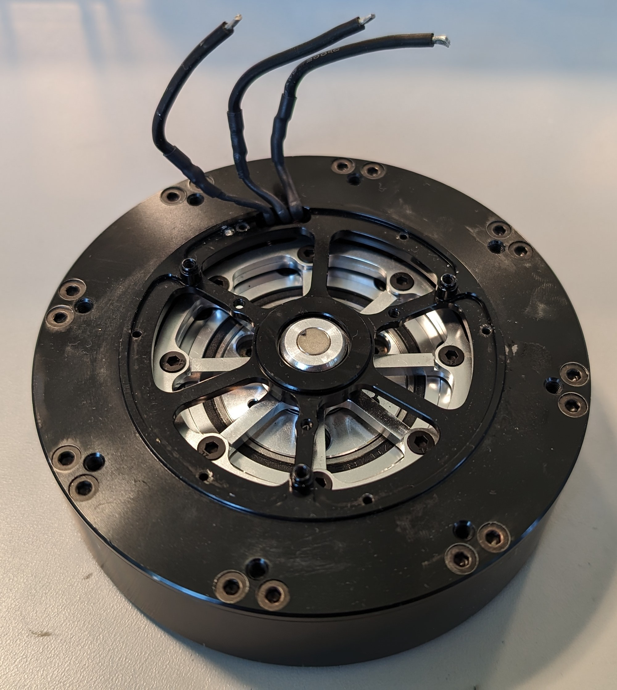

## Dynamixels

When the actuated head is installed, the robot also has 3 XH430-W350T dynamixel
motors. See [actuated head assembly doc](actuated_head_assembly.md) for installation
information and additional details.

## Electronics

The source of truth for electronics designs is in `hardware/electronics`. We
provide Altium source files for all PCBAs listed below.

### PCBAs

#### Cortes & Gebru (Motor Driver)

Cortes and Gebru are stacked boards on the back of each motor. The Gebru board
contains the gate driver; The Cortes board contains the microcontroller,
sensors, and connectivity (EtherCAT).

In addition to the main motor control functionality, the Cortes board comes with
a number of additional sensors. For example, it has a 9 DoF IMU.

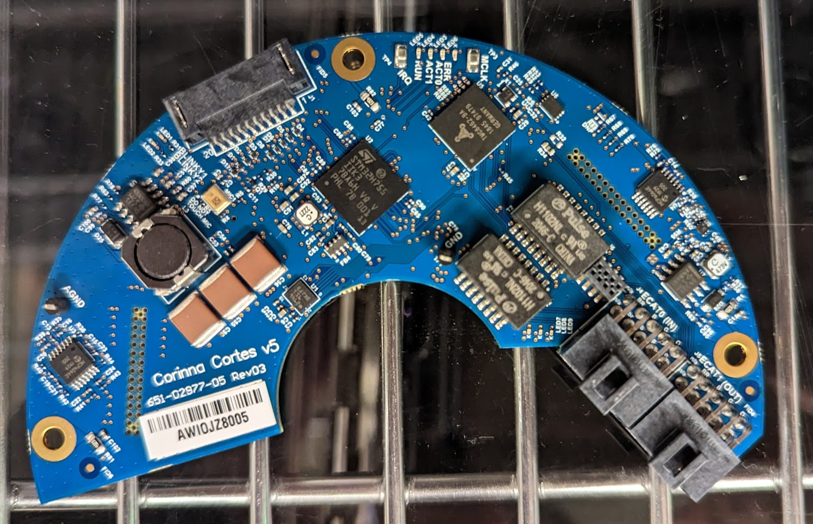
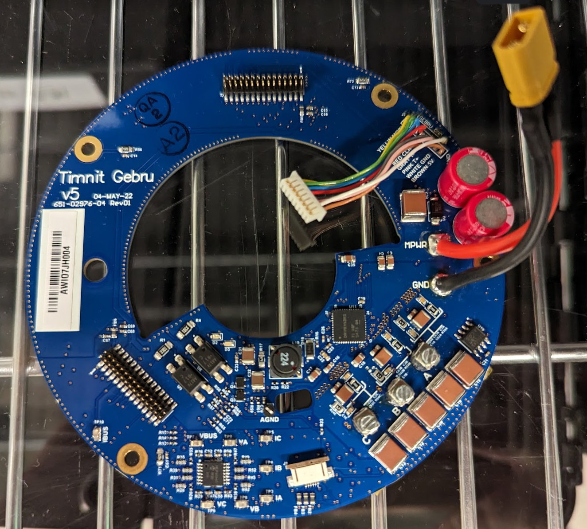

#### Ada (Encoder)

This is the encoder board based on the
[MA732](https://www.monolithicpower.com/en/ma732.html) sensor. In addition to
the encoder chip, it also provides connectivity for the thermistor on the motor.

Note: The pinout of the Ada board is compatible with the
[RLS Aksim-2 encoder](https://www.rls.si/eng/aksim-2-off-axis-rotary-absolute-encoder).

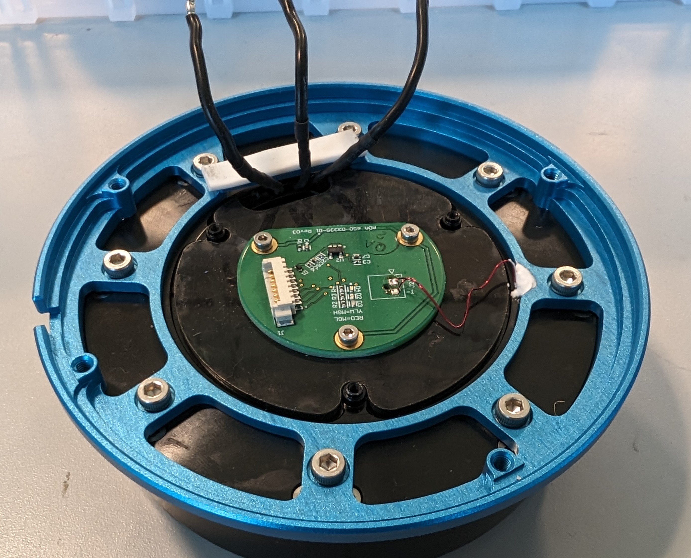

#### Holberton (Single Board Motor Driver)

The Holberton board is a newer generation of the motor driver. It is a single
board replacement for the Gebru/Cortes/Ada stack and the firmware will
transparently run on either variant. Except for the use of different connectors,
the Holberton is a drop-in alternative for the Gebru/Cortes/Ada combo.

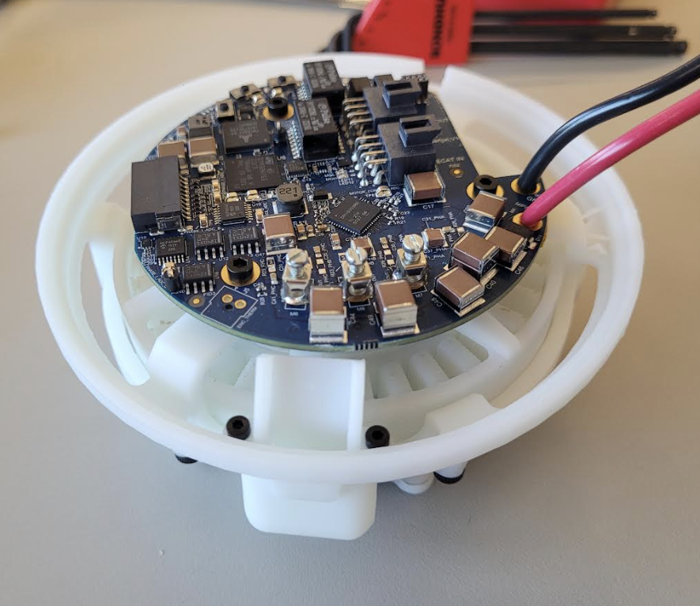

The Holberton uses 2x4 Nanofit connectors for the EtherCAT and STO
connectivity, rather than the 2x4 connectors used on the Cortes. The pinout is
identical as 2 pins are unused on the Cortes connectors.

The Holberton uses a smaller debug/programming connector than the Cortes board.
The Mataric board has support for both the Cortes and Holberton variants.

The board is rated for up to 75V/50A peak. We limit the current to 20A for
everyday use.

#### Grace & Hopper (Wireless STO)

These boards implement the wireless STO (E-stop) functionality. The Grace board
is the off-robot transmitter; The Hopper board is the receiver inside the
robot's torso.

Note: The Grace and Hopper boards are paired. Each robot has its own E-stop.

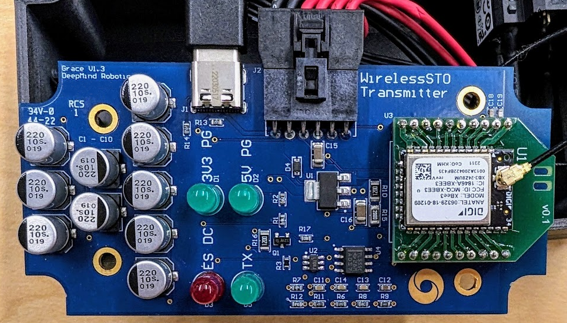
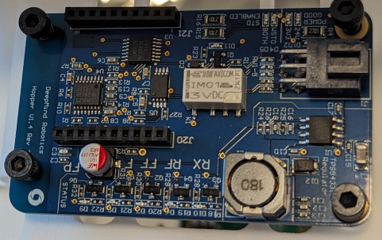

#### Hamilton (IMU Breakout)

The Hamilton board is a small breakout board for the torso IMU. It has a
USB-to-serial converter to enable communication with the IMU:

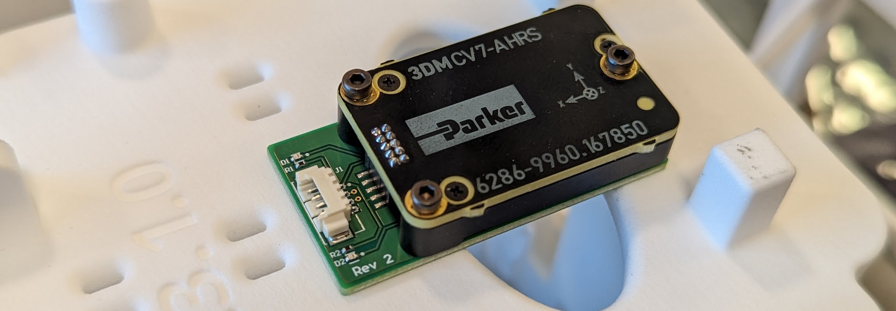

#### Jackson (Actuated Head)

The Jackson board controls the actuated head. More precisely, this board:

-   Controls Dynamixel motors (like a [U2D2](https://www.robotis.us/u2d2/)).
-   Powers Dynamixel motors by stepping down the battery voltage. and using a
    single USB C connection.
-   Provides a USB 3 passthrough for the OAK cameras in the actuated head.
-   Provides USB hub functionality.
-   Has an audio amplifier (e.g. to power a small speaker).

Note that the Jackson board is only used with the actuated head robot variant.

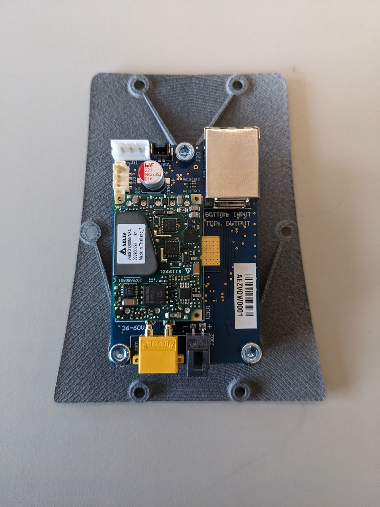

#### Fei-Fei (Power Distribution)

This is a very simple board that splits the input power (battery) 4 ways (1 XT60
output per leg), with 2 additional lower-current (XT30) outputs for auxiliary
devices.

The image below shows an earlier version of the Fei-Fei board without the 2 XT30
connectors. The most recent version has 2 XT30 connectors in the center, one of
which is used to power the Jackson board in case the actuated head is installed.

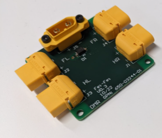

#### Mataric (Cortes/Gebru/Holberton Debug/Programming Board)

The Mataric board provides debug buttons and LEDs for the Cortes & Gebru or
Holberton motor driver. Combined with a J-Link, it is also used to flash new
firmware and configure the electrical and joint angle offsets when replacing
motors.

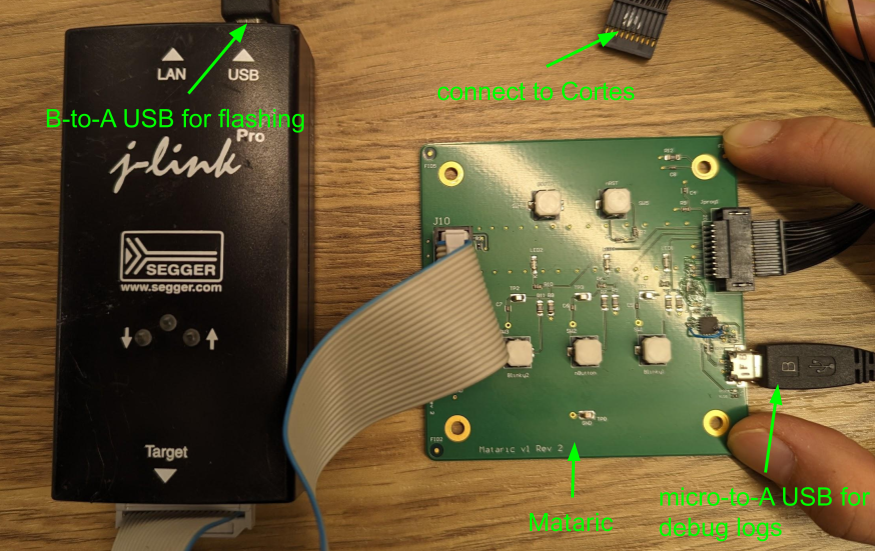

#### Rus (Power Distribution & Conversion)

The Rus board has multiple functions:

-   Convert the battery voltage to 24V (isolated) for the onboard computer &
    sensors.
-   Provide backup power to the 24V circuit (via exposed XT30 connector) to keep
    the onboard computer & sensors up when swapping batteries.
-   Inrush current protection for the motor drivers.
-   Connectors and 24V power for the STO circuit.

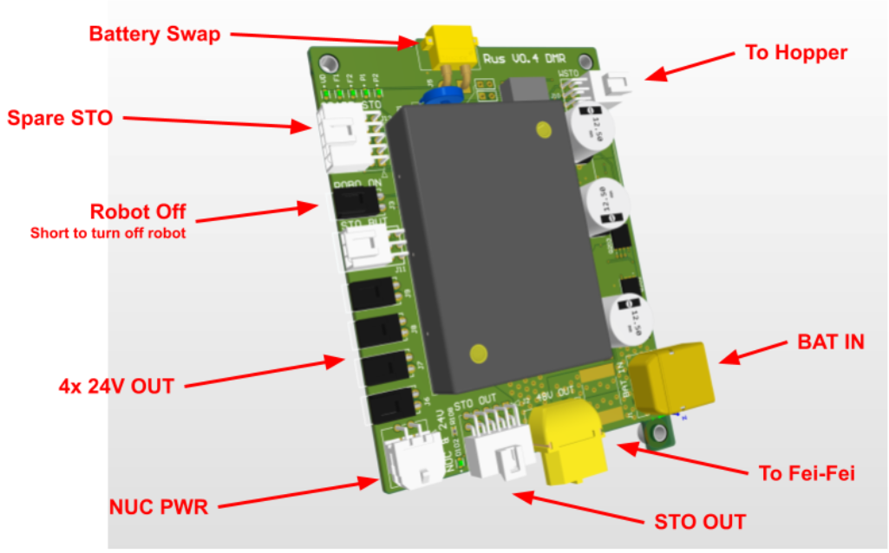

### Battery

We are using off-the-shelf batteries made by DeWalt. The battery voltage is 60V
(15 cell lithium ion). The battery capacity is approximately 122 Wh.

The battery is available in both the UK and the US. However, they are sold under
different manufacturer part numbers:
[DCB606 (US)](https://www.dewalt.com/product/dcb606/flexvoltr-2060v-max-battery-pack-60ah-2-pk)
and
[DCB546 (UK)](https://www.dewalt.co.uk/product/dcb546-xj/xr-flexvolt-6ah-battery).

Note: The DeWalt batteries come in yellow and black housings. These two versions
can be used interchangeably. There is also a larger version of the battery pack,
which looks nearly identical, but won't fit inside the torso.

We use a battery swapper cable to swap batteries in the robot without shutting
down the onboard computer. These click to the DeWalt batteries. The XT30
connector on the swapper cable connects to the external power port next to the
robot's battery slot:

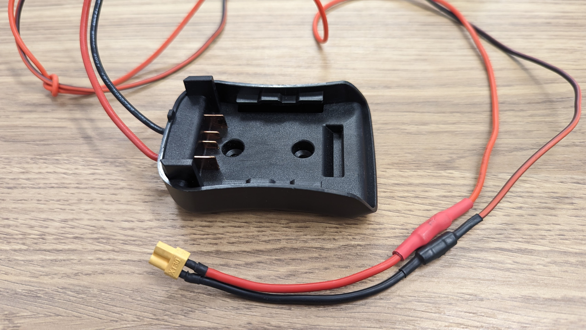

### Onboard Computer

We are using an
[Intel NUC11tnbv7](https://www.mouser.com/datasheet/2/612/NUC11TN_TechProdSpec-2303479.pdf)
as the onboard computer. The NUC controls the EtherCAT bus and talks to the
onboard sensors (e.g. camera/IMU).

CPU
:   [Intel Core i7-1185G7](https://ark.intel.com/content/www/us/en/ark/products/208664/intel-core-i71185g7-processor-12m-cache-up-to-4-80-ghz-with-ipu.html)

Wifi
:   WiFi 6
    [AX201](https://www.intel.com/content/www/us/en/products/sku/130293/intel-wifi-6-ax201-gig/specifications.html)

RAM
:   Kingston FURY Impact 64GB (2x32GB) 3200MT/s DDR4 CL2 KF432S20IBK2/64
    [Kingston](https://www.kingston.com/datasheets/KF432S20IBK2_64.pdf)

SSD
:   Kingston 2048G KC3000 PCIe 4.0 NVMe M.2 SSD
    [Kingston](https://www.kingston.com/en/ssd/kc3000-nvme-m2-solid-state-drive)

#### Additional USB Devices

The NUC has a number of unused USB ports. Two USB-C ports are routed to the
outside of the robot. The external ports support USB4 and Thunderbolt (e.g. you
can connect an external screen).

### Sensors

#### Torso IMU

The torso contains a IMU 3DMCV7-AHRS. See [IMU config](imu_config.md) for the
setup procedure.

The IMU is located below the battery inside the torso as shown below. It might
be a bit confusing that the X-axis shown on the device points to the back of the
robot. This is intentional. See
[Motion Conventions and Range of Motion](barkour_rom.md) for details about the
coordinate frames.

#### RealSense Head Camera

When the robot is equipped with the static head, it uses an Intel RealSense
d435i. See [robot assembly doc](full_barkour_robot_assembly.md) for details.

#### OAK Camera

There is an OAK-FFC-OV9782-M12 camera on the handle of the robot. This camera
attaches to a Luxonis OAK-FFC 4P board. See
[robot assembly doc](full_barkour_robot_assembly.md) on how this is set up for a
static head. For an actuated head, there are 2 OAK cameras. See
[actuated head assembly doc](actuated_head_assembly.md) for details.

## Cabling

Cable drawings can be found in the `/hardware/cable_drawings` directory.

Here's an overview of the main cable types and connectors you might encounter
when using a Barkour robot:

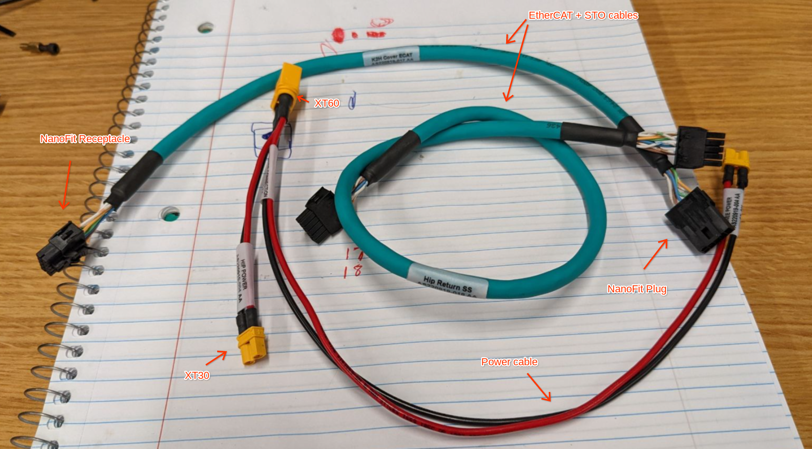

### Power Cables

These are red and black cables with XT30 or XT60 connectors. They are connected
to the battery in a star topology.

Important: Do not operate the robot with a damaged (e.g. exposed copper) power
connector or cable!

Important: Do not touch the exposed copper (e.g. connector pins) on the
XT30/XT60 connectors (60V ⚡).

### EtherCat and STO Cables (ECAT/STO)

The teal cables
([AlphaWire 76030](https://www.alphawire.com/Products/cable/xtra-guard-performance-cable/Xtra-Guard-Industrial-Ethernet-Flex/76030))
with
[Molex NanoFit](https://www.molex.com/molex/products/family/nanofit_power_connectors)
connectors transfer the EtherCAT and STO signals.

The ECAT/STO connectors and cables are easy to inspect due to the use of 4
colored twisted pairs (CAT5E cable). The top row on each connector only has
solid colored wires (orange, green, blue, brown), whereas the bottom row has
their striped counterparts (orange/white, green/white, blue/white, brown/white).
Pins 5 and 10 (2 rightmost pins) are unconnected by design.

The orange and green pairs carry the EtherCAT signals and the blue and brown
pairs are used for the STO signals. The image below show the wiring diagram for
a typical EtherCAT and STO cable:

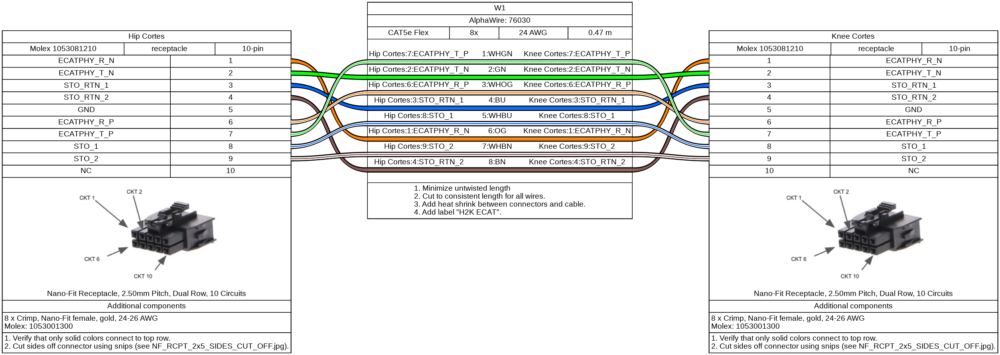

The ECAT/STO cables are daisy-chained from motor driver to motor driver. Each
motor driver has an input and output connector and each cable end is labeled
with I (input) or O (output). The chain starts at the NUC, which provides the
EtherCAT signals to the first motor (front left abduction). The last motor in
the chain is connected to the Rus board, which provides the STO signal.

If you follow the ECAT/STO cables on the robot (e.g. take another look at the
system diagram), you might notice that the daisy chain goes from NUC, to front
left, to front right, to hind right, to Rus. However, the canonical leg order is
front left, hind left, front right, hind right. Indeed, the physical connections
prevent long diagonal connections in the torso. We use EtherCAT aliases to
ensure a logical motor order. See
[Motion Conventions and Range of Motion](barkour_rom.md) for details about the
mapping.

Note: Accidentally swapping an ECAT/STO input and output connection won't damage
the electronics. However, the motors (EtherCAT devices) will logically show up
in a different order.

Important: If you notice a loose pin in a NanoFit connector, do not push it back
in and hope for the best. Replace the cable with a new one or replace the whole
connector (i.e. recrimp all 8 pins and use a new connector).

### External Ethernet Connector

The robot exposes an external ethernet port (image below). Rather than a more
common RJ45 connector, an industrial X-coded M12 connector has been installed to
increase robustness.

There are various M12 to RJ45 cables and adapters available online. We typically
use the PC 1080737 which is a 10m M12 to RJ45 cable.

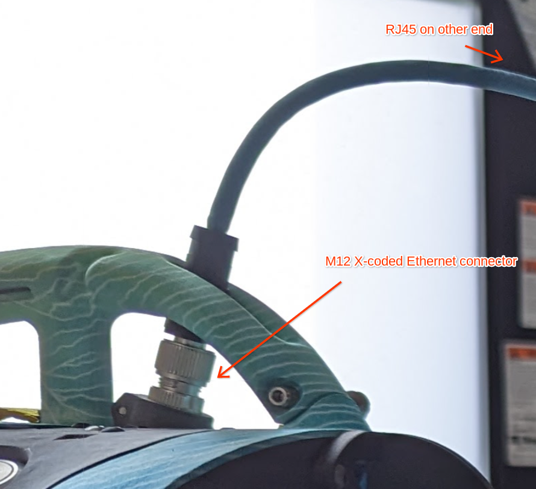
