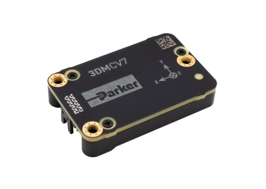
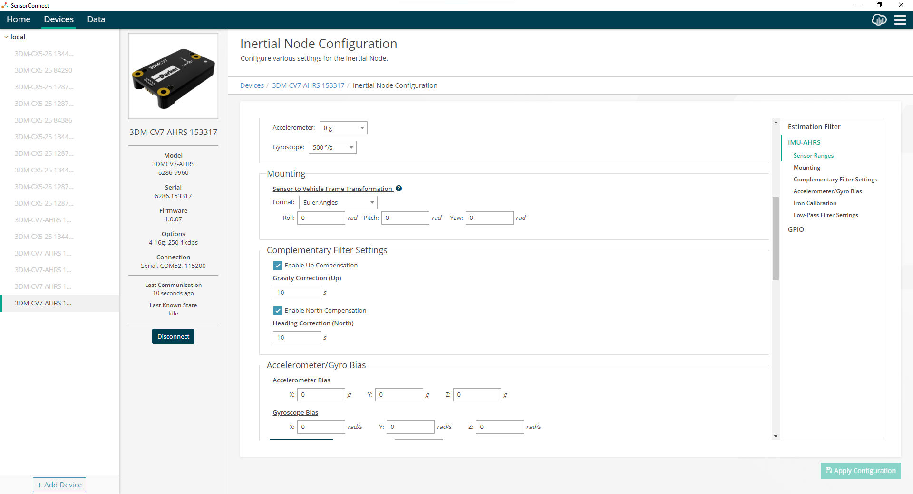

# Onboard IMU Configuration

This page describes the steps required to configure the onboard IMUs. We use the
3DM-CV7-AHRS
([product specs](https://www.microstrain.com/inertial-sensors/3dmcv7-ahrs)) IMU
from MicroStrain.

### Configuration steps for a new device.

1.  Get a brand-new IMU and an
    [FTDI serial device (SparkFun FTDI Basic Breakout - 5V)](https://www.sparkfun.com/products/9716).
    Connect the IMU to a Windows PC. To do so, plug the IMU into a Hamilton
    board and plug in the FTDI cable (or use a breakout board provided by
    Microstrain).

2.  Open the [SensorConnect](https://www.microstrain.com/software/sensorconnect)
    app and go to the Device tab on top left. Click on "+Add Device" button on
    the bottom left. The connection should be via "Serial", at a COM port that
    is available (corresponding to the FTDI device port) and (initially) at a
    baud rate 115200 bps. Hit "Add Device" and you should see the device added
    on the left pane. 
    Clicking on the device name will bring up the dashboard shown:

    

3.  [Optional] Update the IMU firmware. The 3DM-CV7-AHRS firmware has a bug that
    causes the quaternions to sporadically return NaNs. If you encounter this
    issue, contact Microstrain for updated firmware.

4.  Click on "UART baud rate" and change baud rate to 921600.

    

5.  Save the current settings on to the device by clicking "Save/Load Settings",
    and then "Save as Startup Settings".
    

    Make sure that the "Stream Data on Startup" button is **unticked**. This
    prevents the IMU from streaming data immediately on startup (data stream
    will be initiated by the NUC during normal operation).

    

6.  At this point it is helpful to re-add the device following step 2, this time
    configured at the new 921600 baud rate. If the change in baud rate is not
    saved and the device not re-added immediately, the baud rate can revert
    to 115200.

7.  On the new device, click on "configure" and select "Enable North
    Compensation" tickbox under Complementary Filter Settings. Apply the
    configuration.
    

8.  Repeat step 4 to save the current settings on to the device by clicking
    "Save/Load Settings", and then "Save as Startup Settings". "Stream Data on
    Startup" should again be unticked.

9.  Check that the IMU is working properly. Click on "Sampling" and in the IMU
    Channel field, add "Accelerometer vector" and "Gyroscope vector" fields. if
    there is an error message in red, hit "Fix". Hit "Start on the lower right
    as shown:

    

10. Go to the "Data" tab in the top left. In the "Channels" pane, the active
    device should have a green dot next to it indicating that it is streaming
    data. Click "Add Widget" on the top of the right pane and select "time
    series".

    

11. Select a few active channels on the left (with a green dot) to add to the
    widget. The widget should be displaying those channels now. Shake and tap on
    the IMU to see the change in the signals. Hopefully nothing looks odd.

    
