# Leg Linkage Sub-Assembly

[TOC]

NOTE: This is the part that connects into the trimotor. There is a **L**eft and
**R**ight version based on the specific knee crank installed.

## Parts needed per leg

| Part Name                       | Quantity | Description & Details          |
| ------------------------------- | :------: | ------------------------------ |
| Linkage                         | 1        | Long bar with openings on both |
:                                 :          : ends                           :
| Knee Crank                      | 1        | Engraved with **L** or **R**   |
:                                 :          : depending on which side is     :
:                                 :          : being assembled                :
| ⌀3x5mm Dowel Pin                | 2        | Allows the knee crank to index |
:                                 :          : with the motor output          :
| Linkage half pin clearance      | 2        | Part of the pin that connects  |
:                                 :          : linkage to knee crank          :
| Linkage half pin tapped         | 2        | Same as above                  |
| Stainless Steel Ball Bearing    | 4        | Inserts into the linkage       |
| Flanged Ultra-Thin Ball Bearing | 2        | Inserts into the lower leg     |
| Lower Leg                       | 1        |                                |
| Bumper Piece                    | 1        | Rubber "knee" pad              |
| Foot                            | 1        | Rubber padding with pawprint   |
| M4x22mm FHCS                    | 2        | Connects the linkage half pins |

## Assembly steps

NOTE: This assembly is for a **left leg**.

1.  Install x4 bearings (*two on each end*) into a single linkage.

    A. Lightly apply Loctite 638 (*green*) to the outer circumference of the
    bearing and hand-press into place.

    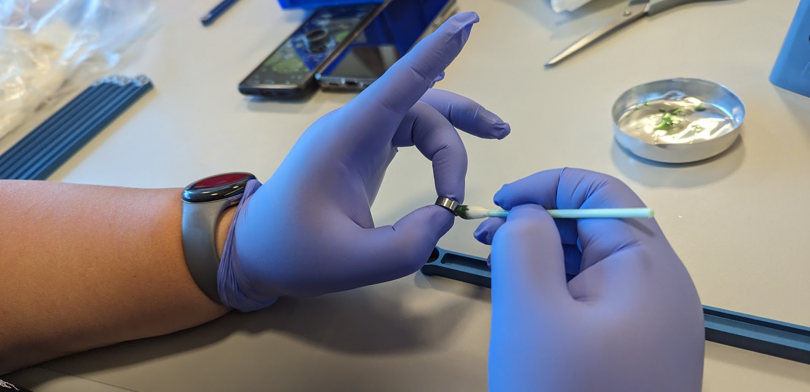

    B. Give each some time to cure before proceeding.

    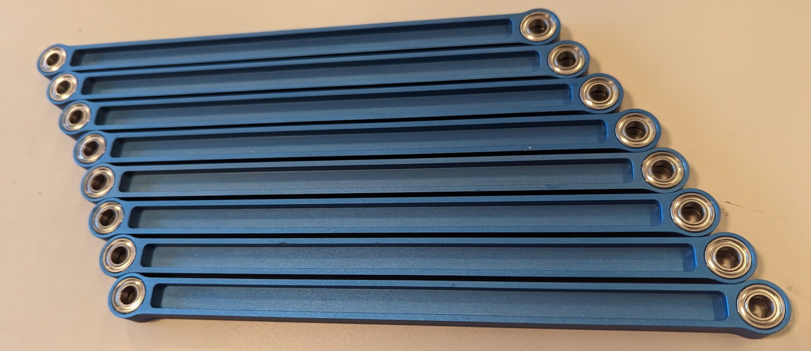

2.  Install a knee crank onto one end of the completed linkage.

    NOTE: This step assigns **R**ight or **L**eft "leggedness" based on the
    markings on the metal.
    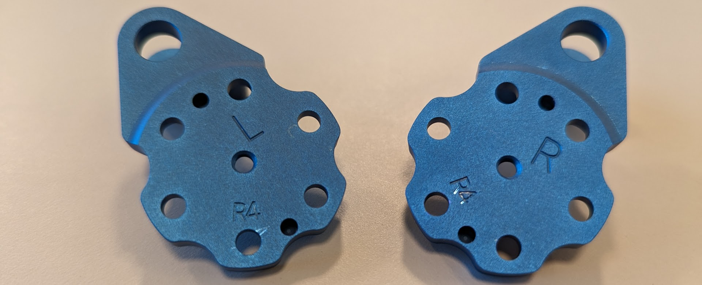

    A. Press x2 ⌀3mm dowel pins into the holes on the back of the knee crank as
    shown:
    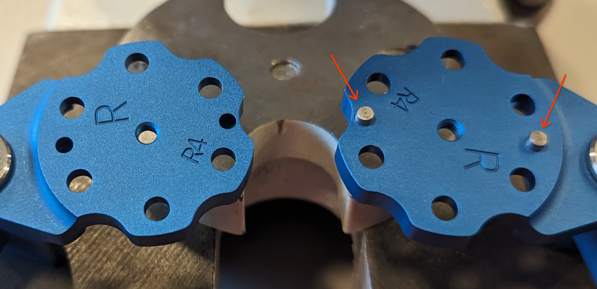

    B. Fasten the crank to the linkage using a pair of clearance and tapped
    linkage half pins, and x1 M4x22mm countersunk bolt dabbed with Loctite 262
    (*red*). **The tapped half pin should be on the back side of the knee crank.
    See images below.**

    Knee Crank Front                                                                         | Knee Crank Back
    :--------------------------------------------------------------------------------------: | :-------------:
    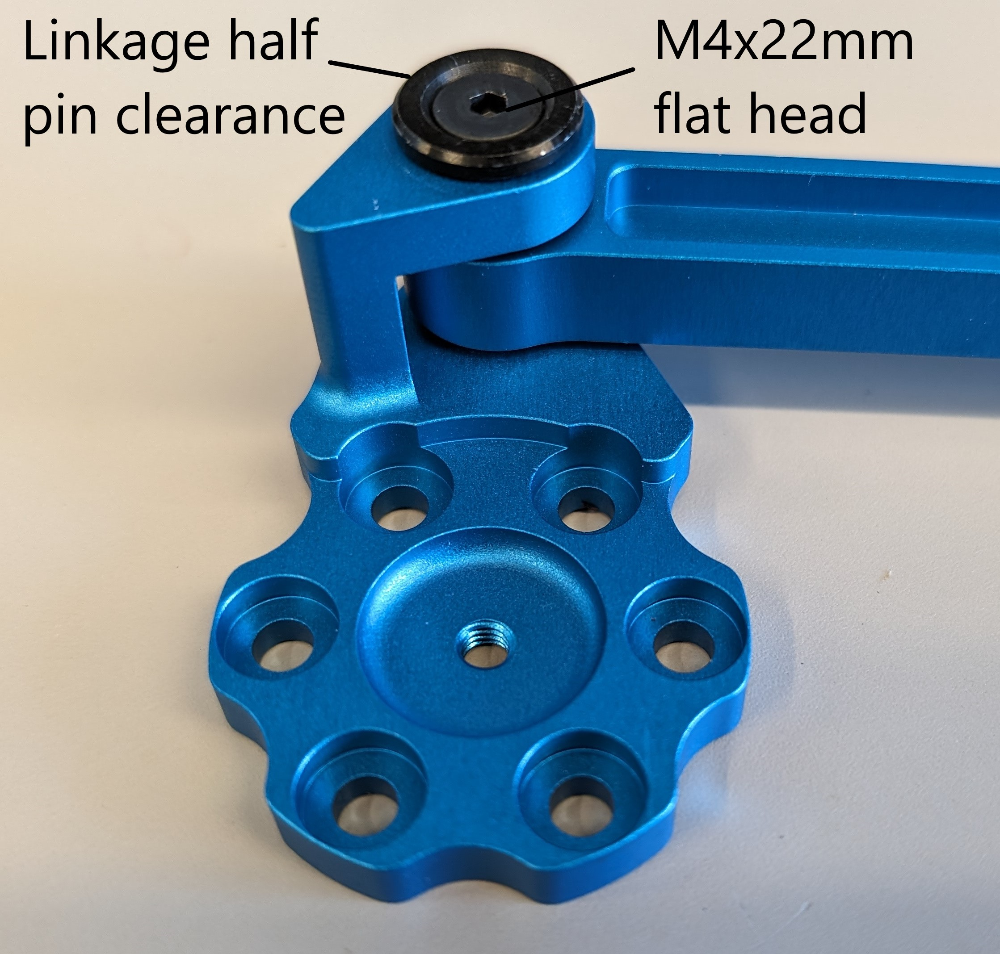 | 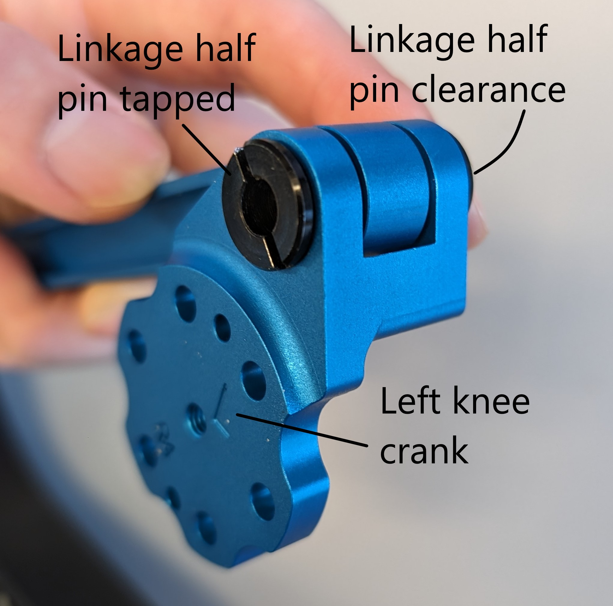

    C. It needs to be tight enough for **no wobble** but smooth axial motion.
    Swing the axle end-to-end to assess the full range of motion.

3.  Prepare the lower leg piece for attachment.

    A. Attach the flanged ball bearing to both sides of the lower leg. These
    press fit into the leg.
    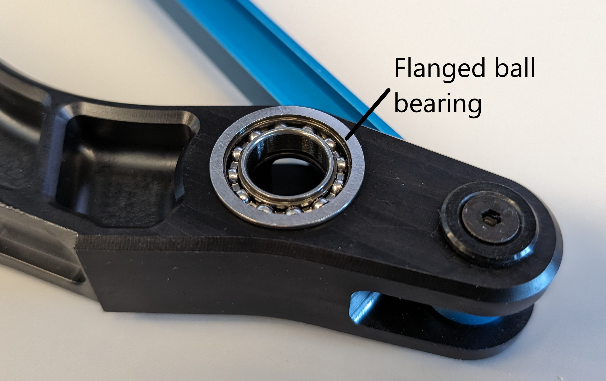

    B. Glue the knee bumper piece into the cut-out of the lower leg.
    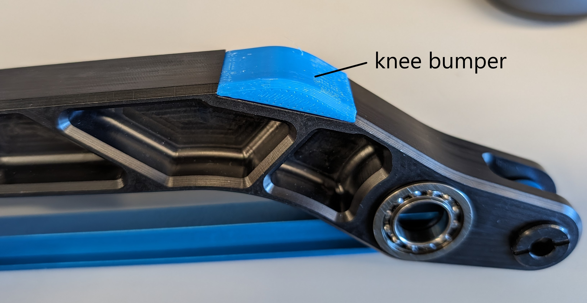

4.  Attach the lower leg piece to the linkage + knee subassembly using the same
    trio of half pins, countersunk bolt, and red Loctite from step #2B. As
    before, confirm by hand whether the joint freely rotates without lateral
    wobble.

    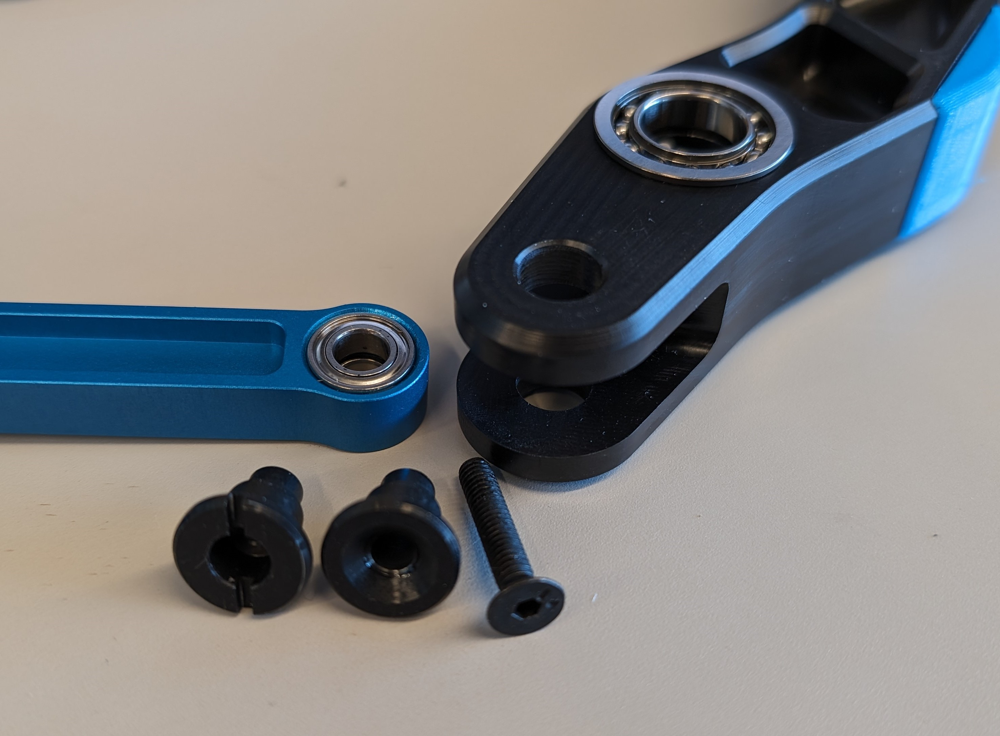

5.  Affix foot and complete the leg.

    A. Slide the foot over the lower leg adapter and route the zip ties through
    the channels as shown.

    B. Use a zip tie gun to secure it.

    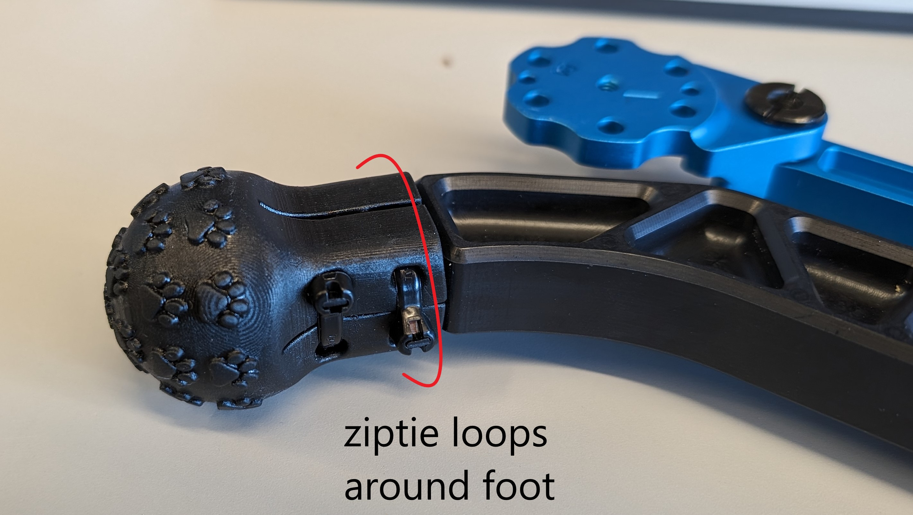

The complete linkage and lower leg should look like the image below.
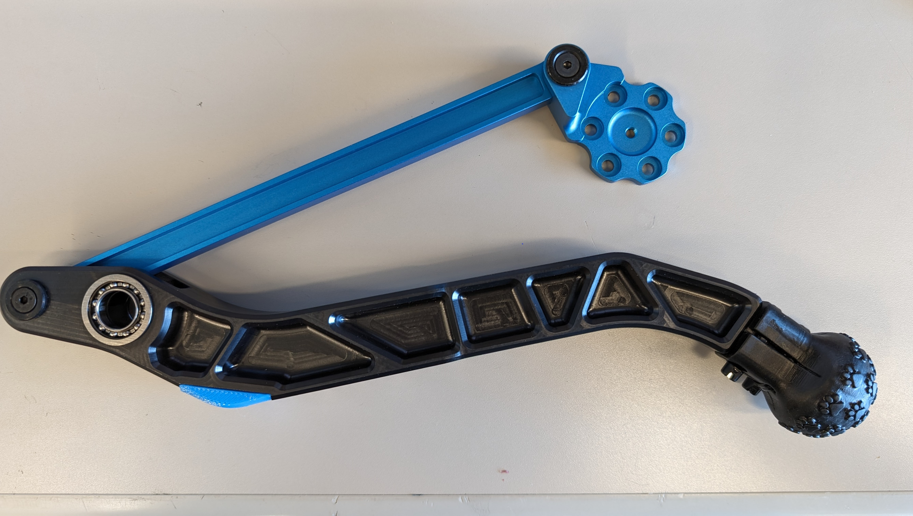
