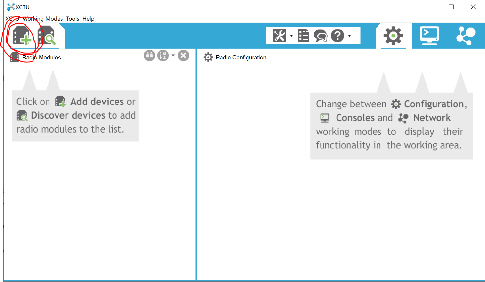

# Wireless STO Assembly

This document describes the assembly of the wireless safety transmitter and
receiver (WSTO) used with the Barkour Robot. The transmitter, known as Grace, is
a handheld device that can be used to remotely stop a robot in an emergency. The
receiver, known as Hopper, is mounted on the robot and receives signals from
Grace.

[TOC]

## Transmitter Assembly {:#transmitter-assembly}

### Bill of materials

1.  Grace PCBA
2.  Remote E-stop transceiver module (Digi XB3-24Z8UM)
3.  Custom XBee breakout board
4.  WSTO cover lid
5.  WSTO cover base
6.  Remote E-stop portable power bank (TNTOR WT-H369)
7.  Remote E-stop power bank cable (Xiwai UC-096-UP-0.13M-XY)
8.  Remote E-stop antenna (Digi A24-HABUF-P5I-ND)
9.  Remote E-stop button (IDEC XA1E-BV404-R)
10. M3 x 20mm countersunk screws (qty 2)
11. Brass Tapered Heat-Set Inserts M3 x 0.5mm thread, 3.8mm length (qty 2)

{#wsto-no-lid}

### Grace PCBA

The electronics design files for Grace are in `hardware/electronics/Grace.zip`.

The Grace PCBA is custom made, whereas the XBee and its sockets are available
off-the-shelf. The XBee sockets are through-hole, single-row, 10-way, 2mm; we
use [Sparkfun PRT-8272][2]{:.external}, but any part meeting specifications is
acceptable. The specific XBee used is the Digi XBee3 PRO (MPN: XB3-24Z8UM).

### Remote E-stop transceiver module

The XBee transceiver on Grace acts as a transmitter.

{#xbee}

We used a custom board to mount the XBee. However, an off-the-shelf board is
acceptable as long as it has the correct dimensions.

*XBee shown soldered onto custom breakout board*

### E-Stop button

[Instruction sheet (external link)][3]{:.external}

The E-stop button is panel-mounted. To install it, follow these steps:

1.  Remove the red button from the E-stop
2.  Position the E-stop in the WSTO housing
3.  Clamp the E-stop with a nut onto the housing
4.  Replace the red button

The E-stop wires are terminated with a Molex nanofit 105307-1206.

#### Contact arrangements (bottom view)

### Antenna

The antenna is mounted to the WSTO housing as shown in
[this image](#wsto-no-lid). The pigtail cable connects to the XBee.

### Portable power bank

The portable power bank is located within the WSTO transmitter housing, beneath
the Grace PCBA. It has 1 USB-A output port and 1 USB-C input and output port.

### Portable power bank cable

The USB-A end of the power bank cable plugs into the portable power bank. The
USB-C end of the cable plugs into the Grace PCBA.

### WSTO transmitter housing

The plastic WSTO transmitter housing is a custom made, 3D printed part. Holes
for the antenna, E-stop button, etc. are included in the design, so no drilling
is required.

## Receiver Assembly {:#receiver-assembly}

### Bill of materials

1.  Hopper PCBA
2.  M3 x 12mm cap head screw (qty 4)
3.  Rus to Hopper cable
4.  On-robot E-stop antenna (Abacon PRO-EX-296)
5.  Remote E-stop transceiver module (Digi XB3-24Z8UM)
6.  Custom XBee breakout board

### Hopper PCBA

The electronics design files for Hopper are in
`hardware/electronics/Hopper.zip`.

XBee headers will likely need to be soldered by hand after the PCBA is
delivered. The M3 screws are used to mount the PCB to the robot. Hopper
uses the TPS54331 buck converter circuit used on Cortes.

### Remote E-stop transceiver module

The XBee transceiver on Hopper acts as a receiver. For photos, refer to the
[Grace section](#xbee).

### On-robot E-stop antenna

This antenna receives the STO signal from the WSTO transmitter assembly.

*Antenna as installed in the DFB*

## XBee Programming and Documentation {:#xbee-programming}

### XCTU

XBees are configured with Digi International's XCTU software tool. This allows
firmware updates and parameter configuration via serial communication with the
XBee. The program is available for Linux, macOS, and Windows.

[XCTU product page and download][7]{:.external}

### Connect the XBee to the host

XBee devices can be configured via any serial to USB connection. We use the
SparkFun [XBee Explorer USB][8]{:.external} breakout for simplicity. This allows
the XBee to be seated in the breakout and connected directly to the host
computer via a mini-USB cable. In this setup, XCTU can detect and reprogram the
XBee without any additional hardware or changes.

To connect the XBee to the host computer, follow these steps:

1.  In the XCTU window, click **Add devices**

1.  In the dialog, click **Finish** {value=2}

### Update the firmware

To update the XBee firmware, follow these steps:

1.  Click the **Radio Configuration** tab
2.  From the **Radio Configuration** pane, click **Update**

1.  In the **Update firmware** dialog, select **XB3-24 > Digi XBee3 802.15.4 >
    200D (Newest)** {value=3}
2.  Click **Update**

### Configure the Grace and Hopper XBee parameters

To configure the Grace (transmitter) and Hopper (receiver) XBee parameters,
follow these steps:

1.  Connect the Hopper XBee to your computer
2.  Note the **Serial Number High** and **Serial Number Low** values (**SH** and
    **SL**) of the Hopper XBee

1.  For Grace, set the parameters as shown in the table below: {value=3}

| Parameter | Parameter Value             | Notes                              |
| --------- | --------------------------- | ---------------------------------- |
| CH        | `19`                        |                                    |
| ID        | `XXXX`                      | Give it a unique PAN ID (for       |
:           :                             : example\: `AAFA`)                  :
| MM        | **Strict 802.15.4 no ACKs   |                                    |
:           : \[1\]**                     :                                    :
| NI        | `TX_XXX`                    | Give it a unique, sequential       |
:           :                             : number (for example\: `TX_101`)    :
| MY        | `FFFF`                      |                                    |
| DH        | **Serial Number High** from | Usually `0013A200`                 |
:           : paired Hopper               :                                    :
| DL        | **Serial Number Low** from  |                                    |
:           : paired Hopper               :                                    :
| PL        | **Highest \[4\]**           | This may not be available based on |
:           :                             : the XBee model                     :
| CA        | `0`                         |                                    |
| RO        | `0`                         |                                    |
| PT        | `14`                        |                                    |

Note: All other parameters use the default values

1.  Click **Write** {value=4}

1.  Note the **SH** and **SL** of the Grace XBee {value=5}
2.  For Hopper (receiver), set the parameters as shown in the table below:

| Parameter | Parameter Value             | Notes                              |
| --------- | --------------------------- | ---------------------------------- |
| CH        | `19`                        |                                    |
| ID        | `XXXX`                      | Give it the same PAN ID as paired  |
:           :                             : Grace above (for example\: `AAFA`) :
| MM        | **Strict 802.15.4 no ACKs   |                                    |
:           : \[1\]**                     :                                    :
| NI        | `RX_XXX`                    | Give it the same number as Grace   |
:           :                             : above (for example\: `RX_101`)     :
| MY        | `FFFF`                      |                                    |
| DH        | **Serial Number High** from | Usually `0013A200`                 |
:           : paired Grace                :                                    :
| DL        | **Serial Number Low** from  |                                    |
:           : paired Grace                :                                    :
| PL        | **Highest \[4\]**           | This may not be available based on |
:           :                             : the XBee model                     :
| CA        | `0`                         |                                    |
| RO        | `0`                         |                                    |
| PT        | `14`                        |                                    |

Note: All other parameters use the default values

1.  Click **Write** {value=7}

[2]: https://www.sparkfun.com/products/8272
[3]: https://us.idec.com/idec-us/en/USD/medias/B-794-7-E.pdf?context=bWFzdGVyfGRvY3VtZW50c3wxMDUwMDU4fGFwcGxpY2F0aW9uL3BkZnxoMTYvaDg0LzkzNjYyNzMzNTk5MDIvQi03OTQtNy1FLnBkZnxlYzI1OGQxNWU2MGUzNDVlZTYzMGFlMzk0OWQ1NjQyZGQ3NmI2YjkzMmU3MzgxYmRkOThjNjY5YmM5OWNmNmRh
[7]: https://hub.digi.com/support/products/xctu/
[8]: https://www.sparkfun.com/products/11812
